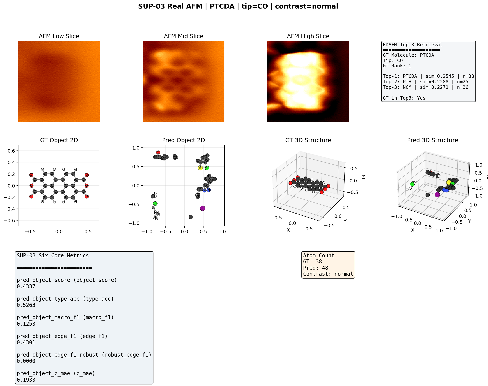
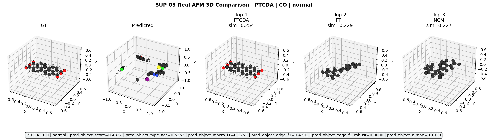

<div align="center">

# AFM 3D Rebuilt

### 从原子力显微镜图像栈重建分子三维结构

**Video Vision Transformer + 对象级联合学习** · 主线 V19 稳定版 · 前沿 V20 探索版

[]() []() []() [](LICENSE) []()


<sub>V19 Full15 主线最佳样本:AFM 输入(左) → 重建 3D 分子结构(中) → GT 对照(右)</sub>

</div>

---

## 一、项目简介

本项目用 **Video Vision Transformer + 对象级联合学习**,从一组 **10 层深度切片 × 128×128** 的 AFM(原子力显微镜)图像栈中,自动重建分子的 **三维原子结构**(坐标 + 元素类型 + 化学键)。

|  | V19 Full15(稳定主线) | V20 Medium10(前沿探索) |
|---|---|---|
| 配置文件 | [`configs/config_v19_object_joint_full15_all.json`](configs/config_v19_object_joint_full15_all.json) | [`configs/config_v20_object_joint_medium10.json`](configs/config_v20_object_joint_medium10.json) |
| 数据规模 | 全样本 68,555 分子 | 缩减集 65k 分子 |
| 训练 epoch | 15 | 10 |
| **关键指标** | `peak_object_score = 0.8016` | `pred_object_score = 0.7141`,Top-3 检索 86.33% |
| 状态 | 投稿就绪 | EXP-01~04 + SUP-01~03 全部完成 |

---

## 二、目录

- [一、项目简介](#一项目简介)
- [二、目录](#二目录)
- [三、可视化展示(Gallery)](#三可视化展示gallery)
- [四、项目结构](#四项目结构)
- [五、项目框架与技术选型](#五项目框架与技术选型)
- [六、整体流程](#六整体流程)
- [七、关键技术说明](#七关键技术说明)
- [八、核心模块介绍](#八核心模块介绍)
- [九、各模块运行指令](#九各模块运行指令)
- [十、项目成果](#十项目成果)
- [十一、数据集说明](#十一数据集说明)
- [十二、常见问题答疑(FAQ)](#十二常见问题答疑faq)
- [十三、引用与致谢](#十三引用与致谢)

---

## 三、可视化展示(Gallery)

### 3.1 主线诊断样本(V19 Full15,15 epoch 训练完毕)

| 最优样本(Best) | 中位样本(Median) | 最差样本(Worst) |
|:---:|:---:|:---:|
|  |  |  |

每张图自上而下:**AFM 输入 10 层切片** → **真值(GT)**:中心图 / 类型图 / 3D → **预测(Pred)**:中心图 / 类型图 / 3D。

### 3.2 Top-5 候选分子对比(V19 闭集检索)


<sub>从 K-1 闭集中按嵌入向量检索 Top-5 候选,与 GT 并排展示。Top-3 命中率 86.33%。</sub>

### 3.3 真实 AFM 迁移(V20 SUP-03,零样本)

| 真实 AFM 输入(PTCDA-CO 系统) | 重建 3D + GT 对照 |
|:---:|:---:|
|  |  |

<sub>未使用任何真实 AFM 数据训练,仅在 11 个真实分子(EDAFM + Camphor)上做零样本推理 — 验证合成→真实工程化可行性。</sub>

### 3.4 训练曲线与课程学习调度

| 训练曲线(V19 主线 15 epoch) | Curriculum α 调度(peak-center 切换) |
|:---:|:---:|
|  |  |

更多可视化资产:`experiments/*/visualizations_*/`、`experiments/*/visual_compar_*/`、`experiments/*/review/samples/`、`outputs/`、`visualizations/`(共 ~310 张图)。

---

## 四、项目结构

```
.
├── src/                           # 主源代码 (~30 kLOC Python)
│   ├── data/                      # 数据集加载、AFM 堆栈读取、增强、环检测
│   ├── models/                    # Video ViT / 三解码器 / 对象级头 / Diffusion (老版)
│   ├── utils/                     # 评估指标、可视化、2D 绘图
│   ├── tools/                     # 实验索引生成等工具
│   ├── train_v19_object_joint.py  # 【主训练入口】(V19/V20 通用)
│   ├── train.py                   # 老版扩散主训练入口
│   ├── v20_eval_*.py              # V20 评估脚本
│   └── v19_visualize_test15.py    # V19 对象级 15 样本可视化
│
├── configs/                       # 所有训练 / 评估配置
│   ├── config.json                              # 老版扩散主配置
│   ├── config_v19_object_joint_full15_all.json  # V19 主线
│   ├── config_v19_object_joint_full6h.json      # V19 短训
│   ├── config_v20_object_joint_medium10.json    # V20 主线
│   ├── config_v20_dense_stage1_medium10.json    # Dense baseline
│   ├── config_v20_graph_baseline_medium10.json  # Graph baseline
│   └── config_v17_*_eval.json                   # V17 评估配置
│
├── scripts/                       # 辅助脚本
│   ├── launchers/                 # 训练/监控/看门狗启动器(*_v19_*.sh / *_v20_*.sh)
│   ├── test/                      # 端到端链路验证
│   ├── tools/                     # 监控、绘图、Top-5 查看
│   └── shell/                     # 可视化批处理、验证修改
│
├── docs/                          # V1–V20 设计与分析文档
│   ├── readme.md                  # 内部开发说明
│   ├── PROJECT_DESIGN_V15.md      # 项目架构定稿
│   ├── PROJECT_DESIGN_V16.md      # 环约束扩展
│   ├── V19_V20实验总索引与总结.md  # 【关键】V19/V20 全量实验索引
│   ├── V19_*_plan.md / V20_*_plan.md
│   ├── analysis/                  # 15 份专题分析
│   └── guides/                    # 使用指南、RDKit 安装、命令对照
│
├── experiments/                   # 训练/评估报告存档(reports/plots/samples/figures)
│   ├── v19_object_joint_full15_all/    # V19 主线产物
│   ├── v19_object_joint_full6h/        # V19 短训参考
│   ├── v20_object_joint_medium10*/     # V20 主线 + EXP-01~04 + SUP-01~03
│   ├── v20_dense_baseline_*/           # 2D Dense baseline
│   ├── v20_graph_baseline_*/           # Graph baseline
│   └── v6~v16/                         # 历史迭代
│
├── tests/                         # 单元测试
├── visualizations/                # V2~V5b 历史可视化
├── outputs/                       # 示例推理输出(curves/demo/分子预测)
├── real_afm/                      # 真实 AFM 验证样本(11 个分子)
├── assets/figures/                # README 引用的精选展示图
├── dataverse_files/readme.txt     # K-1 数据集来源说明
│
├── run.sh                         # 老版扩散主入口
├── README.md / LICENSE / .gitignore
```

> **数据与权重不在仓库内**:`*.pt` / `*.ckpt` / 原始 K-1 数据集均通过 `.gitignore` 排除,需自行准备(见 [§ 九](#九各模块运行指令))。

---

## 五、项目框架与技术选型

### 5.1 总体架构

```
AFM 图像栈 (10 层 × 128×128)
         │
         ▼
  Video ViT 编码器          ← 时空联合自注意力(patch=16, depth=6)
         │
         ▼
  共享特征图 (B, base_ch=64, 128, 128)
         │
 ┌───────┼───────────────────────┐
 ▼       ▼                       ▼
中心图   原子类型/辅助图          Z-height 图
 │       │                       │
 ▼       ▼                       ▼
  对象级联合头 (V19 主创新)
 ├─ Peak-center 解码(预测原子中心,替代 GT-center)
 ├─ Peak 条件类型头  (lambda_type_obj_peak)
 ├─ Peak 条件边头    (lambda_edge_obj_peak)
 └─ 对象计数头      (V20 新增,lambda_object_count)
         │
         ▼
  后处理(V20: 轻量边细化 → 3D 精修)
         │
         ▼
  3D 分子结构(原子坐标 + 类型 + 键)
```

### 5.2 技术栈

| 层级 | 选型 | 理由 |
|---|---|---|
| 深度学习框架 | **PyTorch ≥ 1.10** + `torch.cuda.amp` | 混合精度、CosineAnnealing、断点续训生态成熟 |
| 编码器骨干 | **Video ViT** (`src/models/video_vit.py`) | 10 层 AFM 天然是"伪视频",时空自注意力抓层间相关性 |
| 解码器 | UNet-3 头(中心 / 类型 / Z)+ 对象级条件头 | 三解码器共享特征图,对象级头解决训练-部署不一致 |
| 蒸馏 | **Type Upper Teacher** + 温度 1.5 软标签 | 杂原子 F1:0.22 → **0.86** |
| 后处理 | **RDKit MMFF94 / UFF**(可选,位移 ≤0.3 Å) | 恢复化学合理键长;`RDKIT_AVAILABLE` 自动降级 |
| 训练数据 | **QUAM-AFM (K-1)** 68,555 分子 / 10 元素 | 覆盖 1–85 原子范围 |
| 验证数据 | **真实 AFM**:EDAFM + Camphor(Zenodo) | 验证合成→真实迁移 |
| 优化器 | AdamW + CosineAnnealingLR + warm_start | `lr=8e-5~1.5e-4`, `wd=1e-4`, bs=8 |
| 分布式 | **单卡**(代码暂未接入 DDP) | V100 / A100 40GB 足够 |

### 5.3 模块依赖图

```
src/data/dataset.py  ───┐
                         │
src/models/video_vit.py ─┼─► v19_joint_model.py ─► train_v19_object_joint.py
src/models/v19_*_head.py ┘                              │
                                                        ▼
                       src/utils/metrics.py ◄── src/v20_eval_*.py
                       src/utils/visualize.py ◄─ src/v19_visualize_test15.py
                       src/utils/mol2d.py ◄───── src/visualize_5mol.py
```

---

## 六、整体流程

```
[1] 环境准备       conda + CUDA + PyTorch + (可选) RDKit
       ↓
[2] 数据准备       下载 QUAM-AFM 到 /path/to/K-1/
       ↓          下载真实 AFM(可选)
[3] 快速自检       python3 -m src.quick_test                     (smoke, <1 分钟)
       ↓
[4] 训练           bash scripts/launchers/run_v19_object_joint_full15_all.sh   (V19 主线)
       ↓          bash scripts/launchers/run_v20_object_joint_medium10.sh     (V20 主线)
[5] 监控/看门狗    watch_*.sh / monitor_*.sh / supervise_*.sh
       ↓
[6] Full-test 评估 python3 -m src.v20_eval_fulltest_object   ...
       ↓          python3 -m src.v20_eval_retrieval_full    ...
                  python3 -m src.v20_error_decompose        ...
                  python3 -m src.v20_geom_diagnostics       ...
[7] Baseline       python3 -m src.v20_eval_dense_baseline    ...
       ↓          python3 -m src.v20_eval_graph_baseline    ...
[8] 真实 AFM       python3 -m src.v20_eval_real_afm_cases    ...
       ↓          python3 -m src.v20_visualize_real11       ...
[9] 可视化         python3 -m src.v19_visualize_test15       ...
       ↓
[10] 复盘报告      python3 -m src.v19_object_joint_review    ...
```

---

## 七、关键技术说明

### 7.1 Video ViT 编码器(`src/models/video_vit.py`)

- 输入:`(B, 10, 128, 128)` AFM 堆栈(10 层 ≈ 10 帧视频)
- Patchify:`patch=16` → `(B, 10, 8, 8) = 640` tokens
- 6 层时空 Transformer:每层先 spatial-attn 再 temporal-attn(`einops` rearrange)
- 输出共享特征图 `(B, 64, 128, 128)` 供 3 个解码器消费

### 7.2 对象级联合头(V19 核心创新)

**问题** — 传统做法 "先预测中心图 → 阈值提取中心 → 类型/键采样" 训练用 **GT-center**,部署用 **peak-center**,导致 `peak_object_score` 远低于 `gt_object_score`。

**解法** — V19 引入 **peak-center 条件头**:训练时同时用 GT-center 与 peak-center 做前向,通过 curriculum 逐步切换监督源:

```jsonc
{
  "lambda_type_obj_peak_start": 0.25,   "lambda_type_obj_peak_final": 2.5,
  "lambda_edge_obj_peak_start": 0.25,   "lambda_edge_obj_peak_final": 2.5,
  "center_curriculum_alpha_start": 0.0, "center_curriculum_alpha_final": 1.0,
  "center_curriculum_warmup_epochs": 12
}
```

**效果** — `peak_object_score`:V15 的 0.48 → V19 full15 的 **0.8016**(+67%)。

### 7.3 类型上界蒸馏(Type Upper Teacher)

- 单独训练 `train_v19_type_upper.py` 模型作为类型分类 teacher(GT-center + 局部 crop)
- 主模型学 teacher 的 **软标签**(`temperature=1.5`),`lambda_teacher_type_distill=1.0`
- 杂原子 F1:0.22 → **0.86**(V19) / **0.74**(V20 medium10 缩减集)

### 7.4 对象计数闭环(V20 新增)

`lambda_object_count=1.0` (CE) + `lambda_object_count_mae=0.15` 让模型显式学 "图中原子数",原子计数 MAE 从 Dense baseline 的 **19.86** 降到 V20 的 **0.94**(↓ 21 倍)。

### 7.5 RDKit 几何精修(可选)

`src/models/postprocess.py` 接 MMFF94 / UFF,对预测坐标做 ≤0.3 Å 局部弛豫。无 RDKit 时自动跳过,不影响训练。

---

## 八、核心模块介绍

### 8.1 数据 — `src/data/dataset.py`(476 行)

读取 K-1 的 XYZ + 10 层 AFM 切片;首次扫描生成 **pkl 缓存**(后续秒级启动);`min_corrugation` 滤平躺分子,`require_ring` 可只保留含环分子;3D 旋转(`augment_rotation=true` 时 tilt>30°)、噪声增强;返回 `(afm_stack, center_map, type_map, z_map, atoms_xyz, atoms_type, bonds)`。

### 8.2 编码器 — `src/models/video_vit.py`(190 行)

ViViT 风格的时空 Transformer,详见 [§ 7.1](#71-video-vit-编码器srcmodelsvideo_vitpy)。

### 8.3 主模型 — `src/models/v19_joint_model.py`(163 行)

Video ViT + 共享特征图 + 3 个 UNet 头(中心 / 类型 / Z)+ 2 个对象级头(peak-type / peak-edge)+ 对象计数头:

```python
out = model(afm_stack)
# out.center_logits, out.type_logits, out.z_pred
# out.peak_type_logits, out.peak_edge_logits, out.object_count_logits
```

### 8.4 对象级头 — `v19_center_type_head.py` / `v19_center_edge_head.py`

核心创新(详见 [§ 7.2](#72-对象级联合头v19-核心创新))。训练时同时接 `gt_centers` 与 `peak_centers`,通过 curriculum 切换。

### 8.5 损失与评估 — `src/utils/metrics.py`(1370 行)

6 维评估体系:

1. **Atom-level**:`atom_center_score_r3`、`atom_xy_mae`、`atom_z_mae_r3`
2. **Object-level**:`pred_object_score`、`pred_object_type_acc`、`pred_object_hetero_f1`
3. **Edge**:`pred_object_edge_f1`(strict)/ `_f1_robust`
4. **3D 几何**:`pred_object_heavy_rmsd`、`pred_object_z_mae`、`pred_object_nonplanarity_mae`
5. **检索**:Top-k 命中率、MRR
6. **Gap 分解**:strict vs robust 差距、匹配前后类型准确率差

### 8.6 训练主入口 — `src/train_v19_object_joint.py`(1604 行)

CLI **仅 `--config <json>` 和 `--resume_checkpoint <pt>`**(其余超参全部 JSON 内)。支持 warm_start_checkpoint、断点续训、自动 loss warmup + aux decay + curriculum。

### 8.7 评估套件 — `src/v20_eval_*.py`

| 脚本 | 对应实验 | 输出 |
|---|---|---|
| `v20_eval_fulltest_object.py` | EXP-01 对象级全评估 | `reports/fulltest_object_test.{md,json,csv}` + `samples/` |
| `v20_eval_retrieval_full.py` | EXP-02 闭集检索 | `reports/retrieval_fulltest_test.{md,json}` + `plots/` |
| `v20_error_decompose.py` | EXP-03 缝隙分解 | `reports/gap_decomposition_test.*` + `plots/` + `samples/` |
| `v20_geom_diagnostics.py` | EXP-04 几何诊断 | `reports/geom_diagnostics_test.*` + `plots/` |
| `v20_eval_dense_baseline.py` | SUP-01 2D Dense 对照 | `reports/dense_baseline_fulltest.md` |
| `v20_eval_graph_baseline.py` | SUP-02 Graph 对照 | `reports/graph_baseline_fulltest.md` |
| `v20_eval_real_afm_cases.py` | SUP-03 真实 AFM | `reports/sup03_real_afm_summary.*` + `figures/` |

### 8.8 可视化 — `v19_visualize_test15.py` / `visualize_val.py` / `visualize_5mol.py` / `v20_visualize_real11.py`

生成 `sample_XXXXX.png`(AFM / GT / pred 并排)与 `sample_XXXXX_5mol.png`(Top-5 候选分子对比)。

---

## 九、各模块运行指令

> 所有命令在仓库根目录下执行。训练与评估都需要 GPU。

### 9.1 环境安装

```bash
# 建议 Python 3.12 + CUDA 11.8/12.x
conda create -n micro python=3.12 -y && conda activate micro
conda install -c conda-forge pytorch pytorch-cuda numpy scipy pillow tqdm matplotlib -y
conda install -c conda-forge rdkit -y          # 可选,用于几何精修
pip install einops
```

### 9.2 数据准备

将 **QUAM-AFM (K-1)** 解压到 `/path/to/K-1/`,或在 config 里把 `"data_root"` 从 `"auto"` 改为绝对路径。详见 `dataverse_files/readme.txt`。

真实 AFM(可选,SUP-03 用):

- EDAFM → https://doi.org/10.5281/zenodo.10609676
- Camphor → https://doi.org/10.5281/zenodo.4710346
- 用 `src.v20_prepare_real_afm_edafm` / `src.v20_prepare_real_afm_camphor` 预处理成 10 层 × 128×128

### 9.3 快速自检

```bash
python3 -m src.quick_test
```

### 9.4 训练

```bash
# V19 主线:全样本 68,555 分子, 15 epoch (长训, A100 单卡 ~36h)
bash scripts/launchers/run_v19_object_joint_full15_all.sh

# V20 主线:缩减集 65k, 10 epoch (中等规模, A100 单卡 ~10h)
bash scripts/launchers/run_v20_object_joint_medium10.sh

# 老版扩散模型(ViT + conditional DDPM)
bash run.sh        # ⚠️ 见 FAQ Q1, 建议直接 python3 -m src.train --config configs/config.json
```

> 启动器自动定位仓库根、写日志到 `experiments/<exp>/logs/`、checkpoint 存于 `experiments/<exp>/checkpoints/`。

### 9.5 监控与看门狗

```bash
# 跟踪日志
bash scripts/launchers/watch_v19_object_joint_full15_all.sh

# 检查训练是否卡死(30 分钟无更新判定 stall)
bash scripts/launchers/monitor_v20_object_joint_medium10.sh

# 自动 resume 卡死的训练
bash scripts/launchers/supervise_v20_object_joint_medium10.sh
```

### 9.6 评估(V20 主线)

```bash
CKPT=experiments/v20_object_joint_medium10/checkpoints/best_v19_object_joint.pt

# EXP-01 对象级 Full-test (test split, 512 样本)
python3 -m src.v20_eval_fulltest_object \
    --checkpoint $CKPT \
    --output_dir experiments/v20_object_joint_medium10_exp01_fulltest \
    --split test --batch_size 8

# EXP-02 闭集检索
python3 -m src.v20_eval_retrieval_full \
    --checkpoint $CKPT \
    --output_dir experiments/v20_object_joint_medium10_exp02_retrieval_fulltest \
    --split test --batch_size 8

# EXP-03 缝隙分解诊断
python3 -m src.v20_error_decompose \
    --checkpoint $CKPT \
    --output_dir experiments/v20_object_joint_medium10_exp03_gap_decompose \
    --batch_size 8

# EXP-04 几何诊断
python3 -m src.v20_geom_diagnostics \
    --checkpoint $CKPT \
    --output_dir experiments/v20_object_joint_medium10_exp04_geom_diagnostics \
    --batch_size 8
```

### 9.7 Baseline 对照

```bash
# SUP-01 Dense (2D) baseline
python3 -m src.v20_eval_dense_baseline \
    --checkpoint <dense_stage1_best.pt> \
    --config_path configs/config_v20_dense_stage1_medium10.json \
    --output_dir experiments/v20_dense_stage1_medium10_sup01_fulltest \
    --batch_size 16

# SUP-02 Graph baseline
python3 -m src.v20_eval_graph_baseline \
    --checkpoint <graph_baseline_best.pt> \
    --config_path configs/config_v20_graph_baseline_medium10.json \
    --output_dir experiments/v20_graph_baseline_medium10_sup02_fulltest \
    --eval_val_size 512
```

### 9.8 真实 AFM 迁移(SUP-03)

```bash
python3 -m src.v20_eval_real_afm_cases \
    --checkpoint $CKPT \
    --edafm_root /path/to/edafm-data \
    --camphor_structure_root /path/to/camphor/structures \
    --output_dir experiments/v20_object_joint_medium10_sup03_real_afm

python3 -m src.v20_visualize_real11 \
    --checkpoint $CKPT \
    --summary_json experiments/v20_object_joint_medium10_sup03_real_afm/reports/sup03_real_afm_summary.json \
    --real_afm_roots "experiments/v20_object_joint_medium10_sup03_real_afm/edafm_cases,experiments/v20_object_joint_medium10_sup03_real_afm/camphor_cases" \
    --output_root experiments/v20_object_joint_medium10_sup03_visual11
```

### 9.9 可视化

```bash
# V19 对象级 15 样本
python3 -m src.v19_visualize_test15 \
    --checkpoint $CKPT \
    --output_root experiments/v20_object_joint_medium10_epoch10_visual15 \
    --num_samples 15 --peak_threshold 0.45 --min_distance_px 2 --batch_size 8

# 5 分子候选对比
python3 -m src.visualize_5mol \
    --checkpoint $CKPT --num_samples 15 --output_dir outputs/5mol_demo

# 老版扩散验证集可视化
python3 -m src.visualize_val \
    --checkpoint checkpoints/best_diffusion.pt \
    --num_samples 100 --output_dir outputs/val_diffusion
```

### 9.10 复盘报告

```bash
python3 -m src.v19_object_joint_review \
    --checkpoint $CKPT \
    --history experiments/v19_object_joint_full15_all/checkpoints/history_v19_object_joint.json \
    --output_dir experiments/v19_object_joint_full15_all/review \
    --batch_size 16 --report_title "V19 Full15 Final Review"

# 重新生成 V19/V20 索引表
python3 -m src.tools.generate_v19_v20_experiment_summary
```

---

## 十、项目成果

### 10.1 V19 Full15 主线最佳指标

| 指标 | 初始值 | 最优值 | 提升 |
|---|---|---|---|
| **pred_object_score** | 0.4849 | **0.8016** | +67% |
| pred_object_type_acc | 0.2538 | **0.8185** | +56 pp |
| pred_object_hetero_f1 | 0.2201 | **0.8649** | +65 pp |
| atom_center_score_r3 | 0.9983 | 0.9991 | ≈ 上限 |
| atom_xy_mae | 0.0174 | 0.0110 | ↓ 37% |
| atom_z_mae_r3 | 0.1003 | 0.0893 | ↓ 11% |

### 10.2 V20 Medium10 全评估(512 测试样本)

- **对象级综合** — `pred_object_score 0.7141 ± 0.086`,`pred_object_3d_score 0.8112 ± 0.056`
- **类型识别** — Top-1 类型准确率 **69.42%**,杂原子 F1 **74.34%**
- **图结构** — 严格边 F1 **0.6358**,稳健边 F1(放宽对齐)**0.9138**,缝隙 0.2780
- **几何精度** — 重原子 RMSD **0.066 Å**,Z-MAE **0.095 Å**,键长 MAE **0.187 Å**,93.16% 样本两两距离误差 ≤ 0.25 Å

### 10.3 闭集检索(EXP-02)

| 指标 | 数值 |
|---|---|
| Top-1 命中率 | **74.22%** |
| Top-3 命中率 | **86.33%** |
| Top-5 命中率 | **90.23%** |
| MRR | **0.8118** |
| 中位排名 | 1.0 |

大分子(≥35 原子)Top-1 达 **80.47%**,小分子(≤22 原子)**70.75%**。

### 10.4 对比 2D Dense Baseline(SUP-01)

| 指标 | V20(Object) | Dense(2D) | 提升倍数 |
|---|---|---|---|
| pred_object_score | 0.7141 | 0.2986 | **×2.39** |
| pred_object_type_acc | 0.6942 | 0.1221 | **×5.68** |
| pred_object_macro_f1 | 0.5345 | 0.0521 | **×10.25** |
| pred_object_hetero_f1 | 0.7434 | 0.2080 | **×3.57** |
| 原子计数 MAE | **0.94** | 19.86 | **÷21.1** |

### 10.5 真实 AFM 迁移(SUP-03)

在 **11 个真实 AFM 分子**(Camphor + EDAFM 系列)上完成端到端预测与可视化,验证合成→真实的工程化可行性。详见:

- 报告 — `experiments/v20_object_joint_medium10_sup03_real_afm_expanded/reports/sup03_real_afm_summary.md`
- 图谱 — [§ 3.3](#33-真实-afm-迁移v20-sup-03零样本) 与 `experiments/v20_object_joint_medium10_sup03_real_afm/figures/`

---

## 十一、数据集说明

| 数据集 | 来源 | 规模 | 用途 |
|---|---|---|---|
| **QUAM-AFM (K-1)** | Dataverse(ver. 10-2022) | 68,555 分子 × 10 层 AFM | 主训练集 |
| **EDAFM** | Zenodo [`10.5281/zenodo.10609676`](https://doi.org/10.5281/zenodo.10609676) | 6 个真实系统 | SUP-03 零样本验证 |
| **Camphor Adsorbate** | Zenodo [`10.5281/zenodo.4710346`](https://doi.org/10.5281/zenodo.4710346) | 5 个樟脑吸附系统 | SUP-03 零样本验证 |

- **元素覆盖** — H, C, N, O, F, S, P, Cl, Br, I(10 种)
- **原子规模** — 1–85 原子/分子
- **AFM 参数** — K = 40 pN/nm,Amplitude = 40 pm
- **切片** — 128×128 × 10 深度

可视化资产位置一览(本仓库已包含 ~310 张图):

| 类别 | 位置 |
|---|---|
| V19 训练曲线 / 调度 | `experiments/v19_object_joint_full15_all/review/plots/` |
| V19 诊断样本(best/median/worst) | `experiments/v19_object_joint_full15_all/review/samples/` |
| V19 主样本 × 15 | `experiments/v19_object_joint_full15_all/visualizations_object15/` |
| V19 对比样本 × 15 | `experiments/v19_object_joint_full15_all/visual_compar_object15/` |
| V20 EXP-02 检索分层图 | `experiments/v20_object_joint_medium10_exp02_retrieval_fulltest/plots/` |
| V20 EXP-03 缝隙直方图 | `experiments/v20_object_joint_medium10_exp03_gap_decompose/plots/` |
| V20 EXP-04 几何分布 | `experiments/v20_object_joint_medium10_exp04_geom_diagnostics/plots/` |
| V20 SUP-03 真实 AFM × 11 | `experiments/v20_object_joint_medium10_sup03_real_afm_expanded/figures/` |
| V2–V5b 历史样本 | `visualizations/v2_* ~ v5b_*` |
| 训练样例输出 | `outputs/curves/`、`demo/`、`molecules_*/`、`val_resnet/` |

总实验索引见:[`docs/V19_V20实验总索引与总结.md`](docs/V19_V20实验总索引与总结.md)。

---

## 十二、常见问题答疑(FAQ)

### Q1. `run.sh` 跑完最后几步没产出 / 报错

`run.sh` 的 `[3/5]` 段 heredoc 传 `$SAVE_DIR` 时会变空(已知 bug),`[2/3] resnet3d` 段也被注释。建议直接:

```bash
python3 -m src.train --config configs/config.json
python3 -m src.visualize_val --checkpoint checkpoints/best_diffusion.pt --output_dir outputs/val_diffusion
```

详见 `docs/guides/COMMAND_COMPARISON.md`。

### Q2. 训练卡住 / 显存空转

仓库自带 `scripts/launchers/monitor_v20_object_joint_medium10.sh`,以 `STALL_SECONDS=1800` 判定 stall(基于 `latest_*.pt` + `history_*.json` + `logs/*.log` mtime)。报警后用配套 `supervise_*.sh` 自动 resume。

### Q3. 数据集找不到

`config` 里 `"data_root": "auto"` 会依次试 `/root/autodl-tmp/K-1/` 和 `/root/autodl-tmp/micro/dataverse_files/SUBMIT_QUAM-AFM/QUAM`。两路都不存在就失败。改为绝对路径或解压到其中之一。

### Q4. 首次训练加载数据很慢

`src/data/dataset.py` 首次扫描后生成 **pkl 缓存**,后续启动 <5 秒。改了 `min_corrugation` / `require_ring` / `max_samples` 等过滤项需手动删旧 pkl。

### Q5. RDKit 是必须的吗?

**不是**。`src/models/postprocess.py` 通过 `try: import rdkit` 判断 `RDKIT_AVAILABLE`,无 RDKit 时自动跳过 MMFF94/UFF 弛豫,训练 / 推理流程不受影响。安装:`conda install -c conda-forge rdkit`(`docs/guides/RDKIT_INSTALLATION.md` 含完整验证清单)。

### Q6. 如何快速 smoke 验证?

按耗时由短到长:

1. `python3 -m src.quick_test` — 模块级,<1 分钟
2. 套用 `configs/config_*_smoke.json`(若存在)+ 主训练脚本,跑几分钟
3. `configs/config_v19_object_joint_full6h.json` — 中规模 ~6 小时

### Q7. 训练指标和 EXP-01 Full-test 数字对不上?

Full-test 用 `val_size=512` 在 **test split** 评估;训练日志的 `val` 在 **val split**。差 ~0.01 级别,见 `fulltest_object_test.md` 里的 "Full-test vs Validation 参考"。

### Q8. 断点续训何时自动触发?

`scripts/launchers/run_v*.sh` 启动时检查 `$SAVE_DIR/latest_v19_object_joint.pt`,存在则 `--resume_checkpoint <它>`,否则从 `warm_start_checkpoint` 或零开始。`supervise_*.sh` 在 stall 后也走这条。

### Q9. 想切到 3D-ResNet 基线?

老版 `src.train` 支持。把 `configs/config.json` 里 `"model_type"` 改成 `"resnet3d"`,再 `python3 -m src.train --config configs/config.json`。V19/V20 对象级主线**不**走这条。

### Q10. 训练脚本为什么只有 `--config` 和 `--resume_checkpoint`?

设计选择 — 所有超参(`epochs`、`lr`、`lambda_*`、`warm_start_checkpoint`)都放 JSON,便于实验对照和 reproduce。CLI 定义在 `src/train_v19_object_joint.py:1587-1589`。

### Q11. 如何启动多卡 DDP?

**当前代码暂不支持**。所有训练以 `nohup python3 -u -m ...` 单进程启动,无 `torchrun` 调用。需手动改 `src/train_v19_object_joint.py`,包装 `DistributedDataParallel` + `DistributedSampler`。

### Q12. OOM 怎么调?

按影响从大到小:

1. 降 `batch_size`(当前 8)
2. 降 `num_workers`(当前 8)
3. 降 `max_samples` 做 smoke
4. 关 `augment_rotation`(减少 dataloader 内存)
5. 评估脚本 `--batch_size` 调到 4 或 2
6. `img_size=128` 是 pipeline 硬编码,改动需同步下游,不推荐

### Q13. 为什么没有 `requirements.txt` / `pyproject.toml`?

历史原因 — 项目从 Jupyter 实验逐步长成完整 pipeline。推荐依赖见 [§ 9.1](#91-环境安装)。欢迎贡献 `pyproject.toml` PR。

---

## 十三、引用与致谢

### 数据集

- **QUAM-AFM** — Rubén Pérez et al., Universidad Autónoma de Madrid。完整引用见 `dataverse_files/readme.txt`。
- **EDAFM** — Zenodo DOI [`10.5281/zenodo.10609676`](https://doi.org/10.5281/zenodo.10609676)
- **Camphor Adsorbate** — Zenodo DOI [`10.5281/zenodo.4710346`](https://doi.org/10.5281/zenodo.4710346)

### License

MIT License — 详见 [LICENSE](LICENSE)。

---

<div align="center">

> 仓库不含训练好的模型权重 / 数据集本体 / 训练 checkpoint(见 `.gitignore`)。
> 需在自己的机器上从 QUAM-AFM 重新训练:
> V19 Full15 ≈ 36h(单 A100),V20 Medium10 ≈ 10h(单 A100)。

</div>
