<div align="center">

# AFM 3D Rebuilt

### 从原子力显微镜图像栈重建分子三维结构

**Video Vision Transformer + 对象级联合学习** · **双主线 V19 + V20**

[]() []() []() [](LICENSE) []()

<table>
<tr>
<td align="center">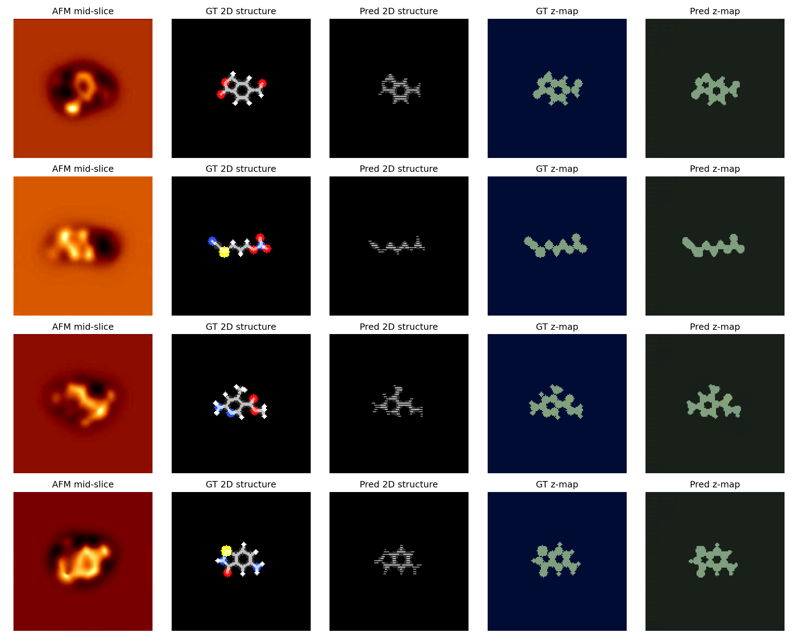<br/><sub><b>V19 Full15</b> · 全样本 68k 分子 · `peak_object_score = 0.8016`</sub></td>
<td align="center">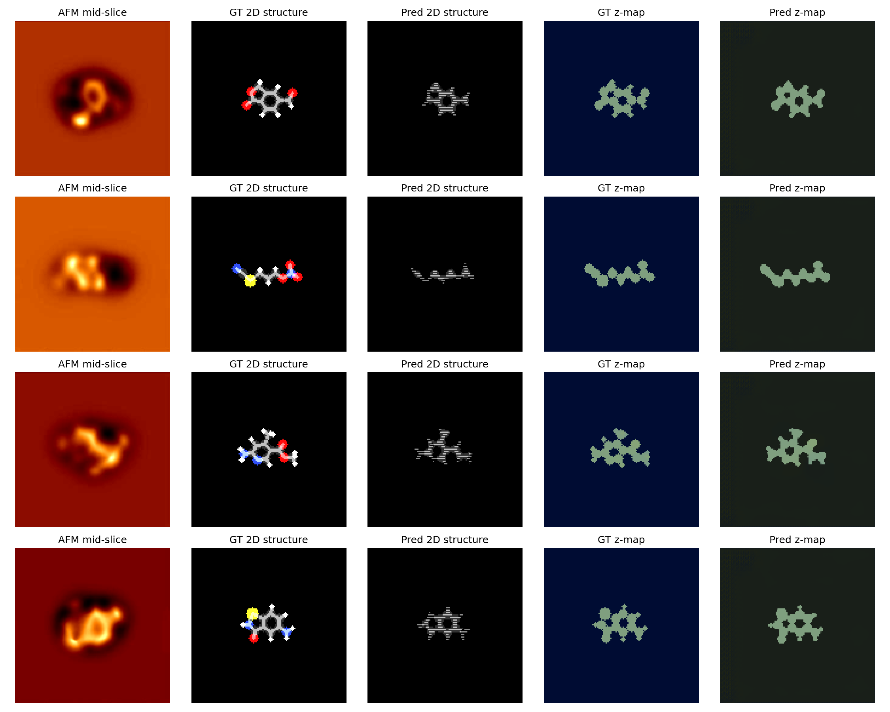<br/><sub><b>V20 Medium10</b> · 闭环架构 · `pred_object_score = 0.7141`</sub></td>
</tr>
</table>

</div>

---

## 一、项目简介

本项目用 **Video Vision Transformer + 对象级联合学习**,从一组 **10 层深度切片 × 128×128** 的 AFM(原子力显微镜)图像栈中,自动重建分子的 **三维原子结构**(坐标 + 元素类型 + 化学键)。

### 1.1 双主线对照

|  | **V19 Full15(数据 / 性能主线)** | **V20 Medium10(架构 / 闭环主线)** |
|---|---|---|
| 配置文件 | [`configs/config_v19_object_joint_full15_all.json`](configs/config_v19_object_joint_full15_all.json) | [`configs/config_v20_object_joint_medium10.json`](configs/config_v20_object_joint_medium10.json) |
| 数据规模 | 全样本 68,555 分子 | 缩减集 65k 分子 |
| 训练 epoch | 15 | 10 |
| 训练时长 | 单 A100 ~36h | 单 A100 ~10h |
| 关键创新 | object-joint 头 + curriculum + 蒸馏 | + 对象计数头 + 双输入类型头 + 预测对象闭环 |
| **核心指标** | `peak_object_score = 0.8016` | `pred_object_score = 0.7141`,Top-3 检索 86.33% |
| 状态 | **投稿就绪**(数据规模 + 性能上限) | **架构原型已验证**(EXP-01~04 + SUP-01/02) |

> V19 与 V20 不是迭代关系,而是**两条互补主线**:V19 用全数据 + 长训证明性能上限,V20 在缩减集上验证完整闭环架构。论文主图用 V19,创新点用 V20。

### 1.2 具体细节对应文档

| 想了解 | 看哪里 |
|---|---|
| 项目原理与设计哲学 | [`docs/PRINCIPLES.md`](docs/PRINCIPLES.md) |
| 网络架构、ViT、对象级头实现 | [`docs/TECHNICAL_DETAILS.md`](docs/TECHNICAL_DETAILS.md) |
| 所有指标的精确定义 | [`docs/METRICS_GLOSSARY.md`](docs/METRICS_GLOSSARY.md) |
| 全部参数与权重清单 | [`docs/CONFIG_REFERENCE.md`](docs/CONFIG_REFERENCE.md) |
| 流程图、架构图、数据流 | [`docs/PIPELINE_AND_FRAMEWORK.md`](docs/PIPELINE_AND_FRAMEWORK.md) |
| 怎么读 EXP-01~04 报告 | [`docs/RESULT_INTERPRETATION.md`](docs/RESULT_INTERPRETATION.md) |
| 扩展 FAQ(技术 + 运行 + 解读) | [`docs/FAQ_EXTENDED.md`](docs/FAQ_EXTENDED.md) |
| 安装 / 训练 / 评估排错 | [`docs/RUNTIME_TROUBLESHOOTING.md`](docs/RUNTIME_TROUBLESHOOTING.md) |
| V19/V20 全实验数字索引 | [`docs/V19_V20实验总索引与总结.md`](docs/V19_V20实验总索引与总结.md) |
| 5 分钟跑通最短路径 | [`QUICKSTART.md`](QUICKSTART.md) |

---

## 二、目录

- [一、项目简介](#一项目简介)
- [二、目录](#二目录)
- [三、可视化展示(Gallery)](#三可视化展示gallery)
- [四、项目结构](#四项目结构)
- [五、项目框架与技术选型](#五项目框架与技术选型)
- [六、整体流程](#六整体流程)
- [七、关键技术说明](#七关键技术说明)
- [八、核心模块介绍](#八核心模块介绍)
- [九、各模块运行指令](#九各模块运行指令)
- [十、项目成果](#十项目成果)
- [十一、版本演化:从 V1 到 V20 走过的弯路](#十一版本演化从-v1-到-v20-走过的弯路)
- [十二、数据集说明](#十二数据集说明)
- [十三、常见问题答疑(FAQ)](#十三常见问题答疑faq)
- [十四、引用与致谢](#十四引用与致谢)

---

## 三、可视化展示(Gallery)

### 3.1 V19 主线诊断样本(Full15,全样本 15 epoch)

| 最优样本(Best) | 中位样本(Median) | 最差样本(Worst) |
|:---:|:---:|:---:|
| 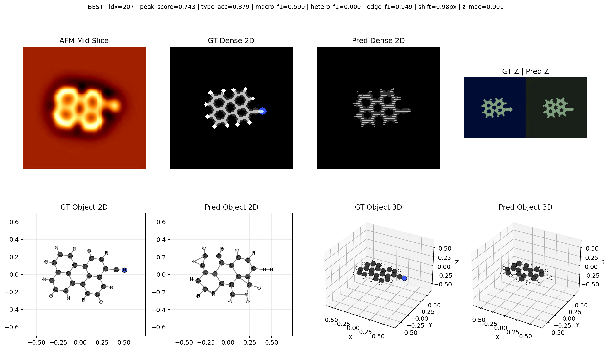 |  | 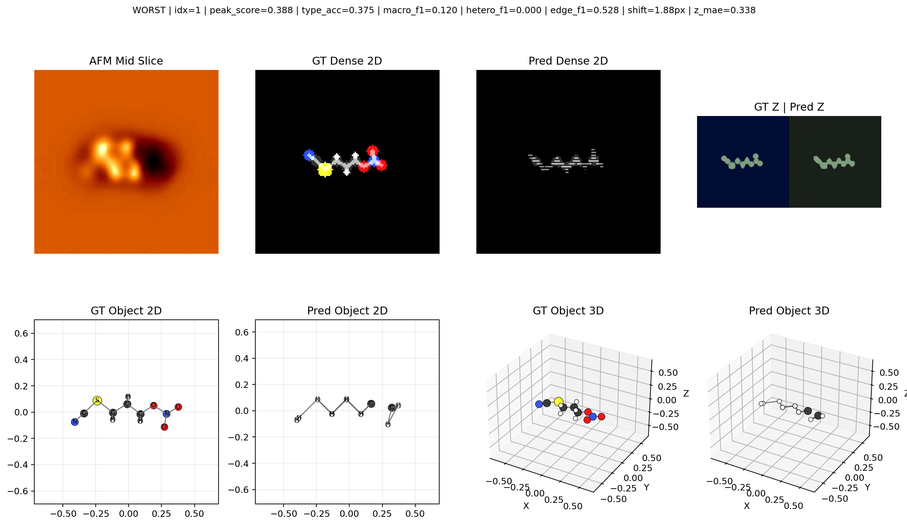 |

每张图自上而下:**AFM 输入 10 层切片** → **真值(GT)**:中心图 / 类型图 / 3D → **预测(Pred)**:中心图 / 类型图 / 3D。

### 3.2 V20 主线诊断样本(Medium10,EXP-01 Full-test)

| 最优样本(Best, 0277) | 中位样本(Median, 0255) | 最差样本(Worst, 0198) |
|:---:|:---:|:---:|
| 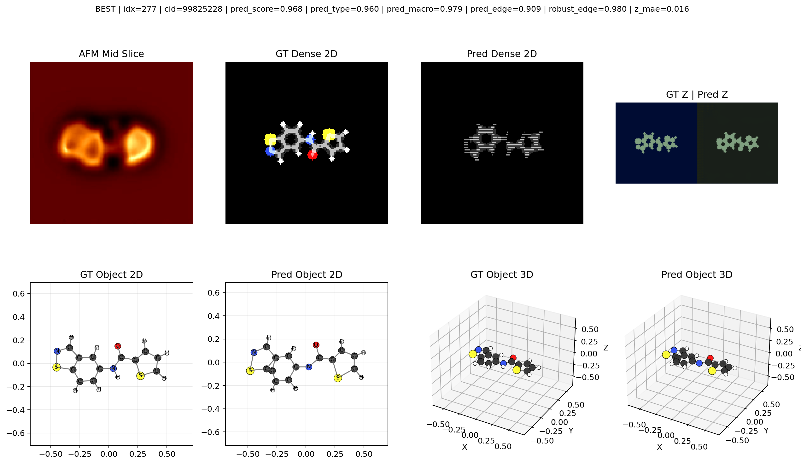 | 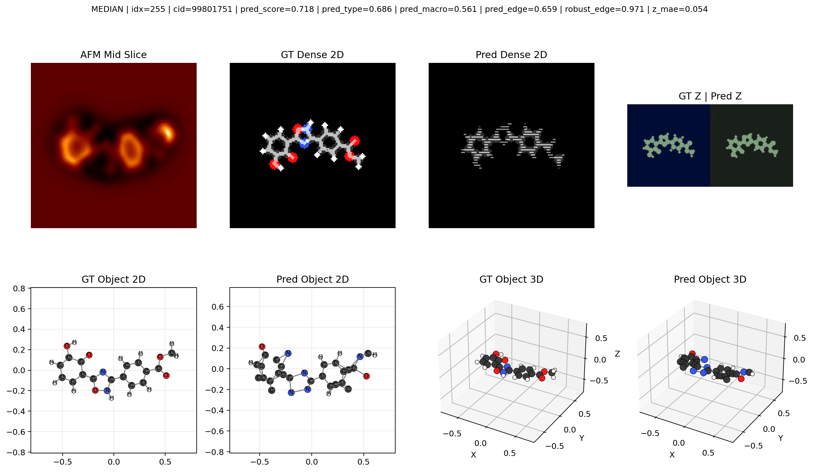 | 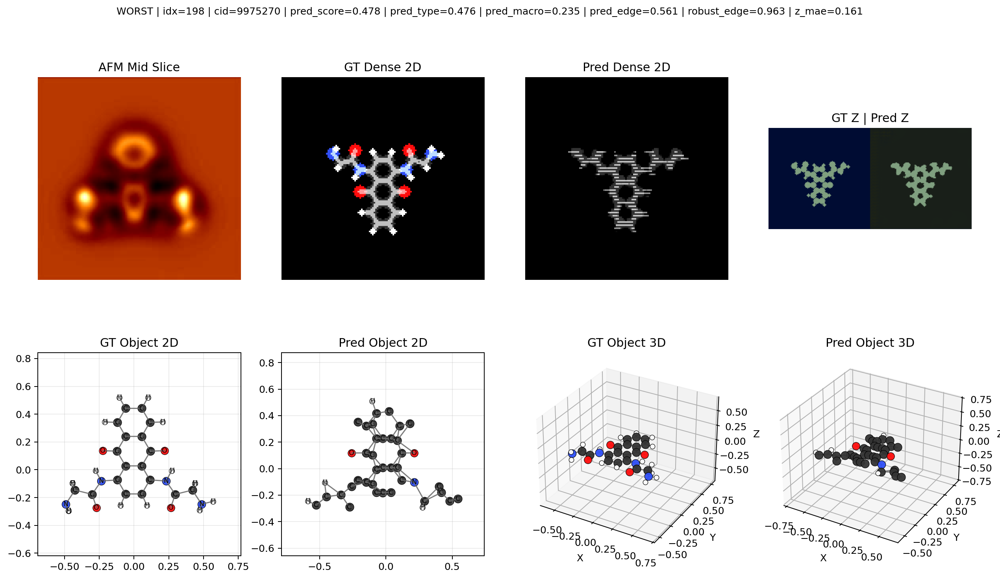 |

V20 引入**对象计数头**与**双输入类型头**,使预测对象路径完全闭环。报告文件 — `experiments/v20_object_joint_medium10_exp01_fulltest/reports/fulltest_object_test.md`。

### 3.3 V20 固定 15 样本可视化(EXP-01 配套)

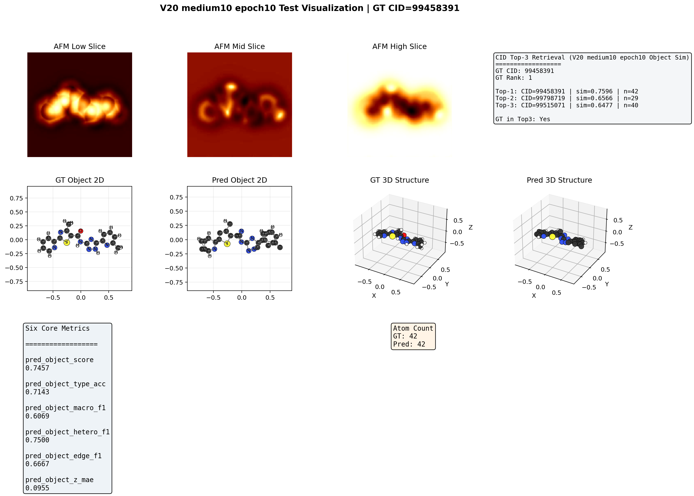

<sub>固定 15 样本可视化(`v19_visualize_test15.py`)— 跨 epoch 可视化模型对**同一组样本**的迭代轨迹。</sub>

### 3.4 V19 Top-5 候选分子检索

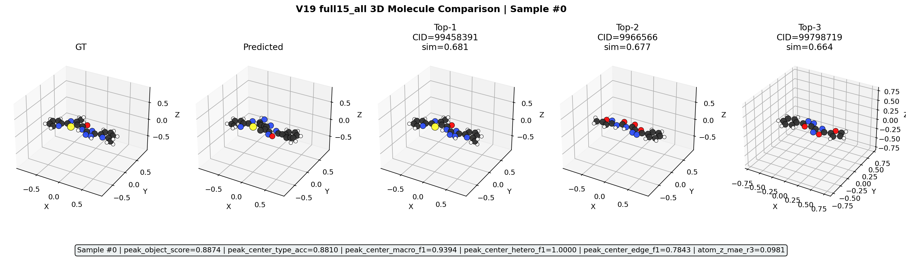

<sub>从 K-1 闭集中按嵌入向量检索 Top-5 候选,与 GT 并排展示。Top-3 命中率 86.33%。</sub>

### 3.5 V20 EXP-02 检索分层 / EXP-03 缝隙诊断 / EXP-04 几何

| 检索分层(原子数 vs Top-K) | EXP-03 Robust Edge Gap 直方图 | EXP-04 覆盖率 vs 配对距离 |
|:---:|:---:|:---:|
| 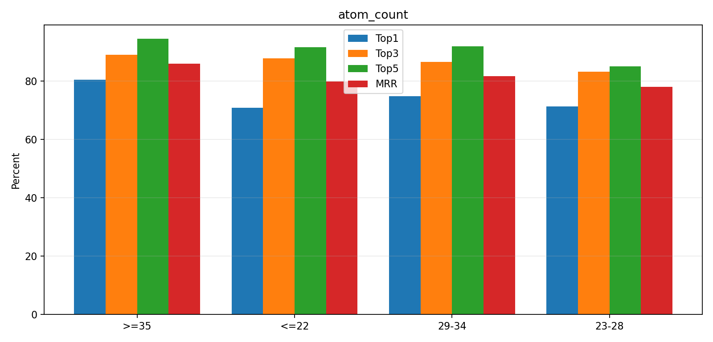 | 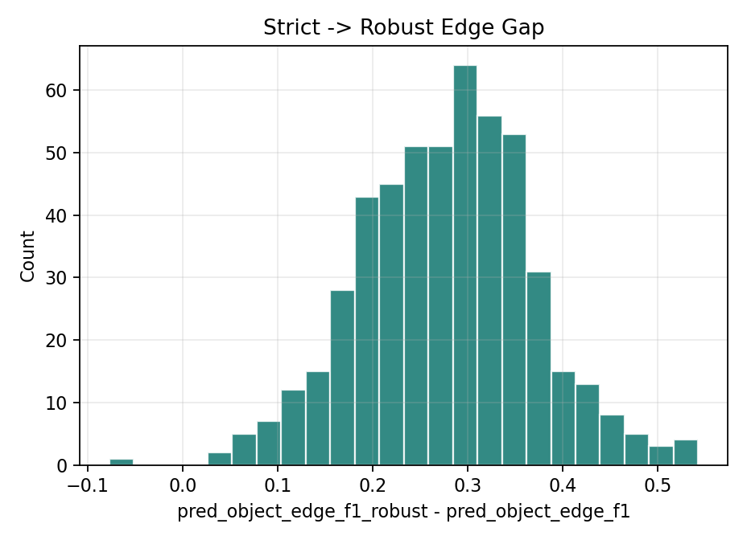 | 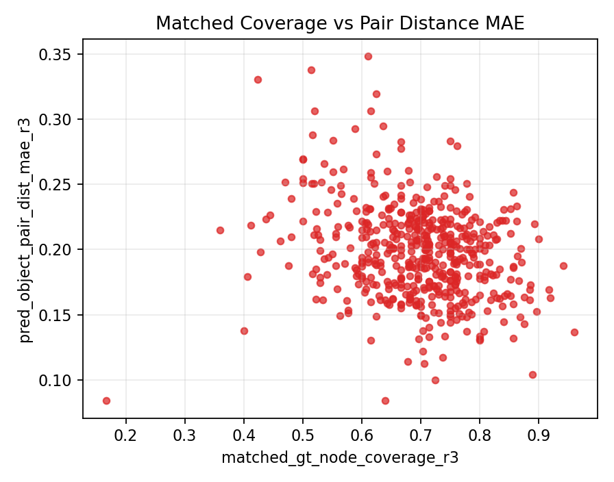 |

详细解读:[`docs/RESULT_INTERPRETATION.md § 3–5`](docs/RESULT_INTERPRETATION.md)。

### 3.6 训练曲线与课程学习调度

| 训练曲线(V19 主线 15 epoch) | Curriculum α 调度(peak-center 切换) |
|:---:|:---:|
| 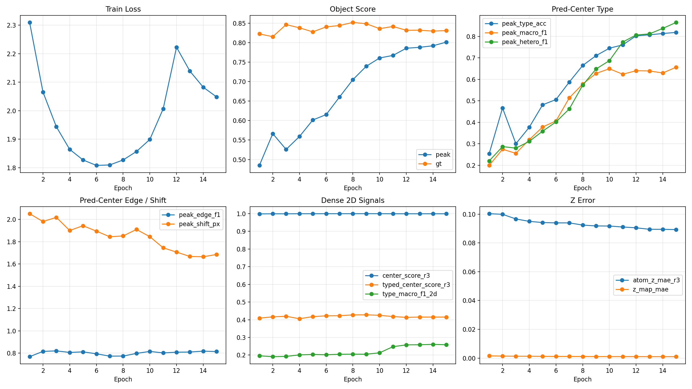 | 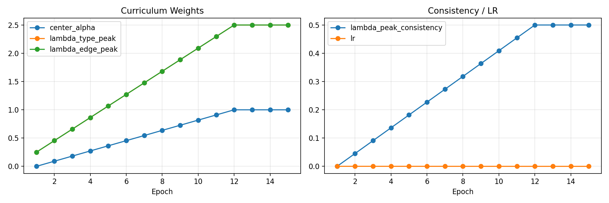 |

更多可视化资产:`experiments/*/visualizations_*/`、`experiments/*/visual_compar_*/`、`experiments/*/review/samples/`、`outputs/`、`visualizations/`(共 ~310 张图)。

---

## 四、项目结构

```
.
├── src/                           # 主源代码 (~30 kLOC Python)
│   ├── data/                      # 数据集加载、AFM 堆栈读取、增强、环检测
│   ├── models/                    # Video ViT / 三解码器 / 对象级头 / Diffusion (老版)
│   ├── utils/                     # 评估指标、可视化、2D 绘图
│   ├── tools/                     # 实验索引生成等工具
│   ├── train_v19_object_joint.py  # 【主训练入口】(V19/V20 通用)
│   ├── train.py                   # 老版扩散主训练入口
│   ├── v20_eval_*.py              # V20 评估脚本
│   └── v19_visualize_test15.py    # V19 对象级 15 样本可视化
│
├── configs/                       # 所有训练 / 评估配置
│   ├── config.json                              # 老版扩散主配置
│   ├── config_v19_object_joint_full15_all.json  # V19 主线
│   ├── config_v19_object_joint_full6h.json      # V19 短训
│   ├── config_v20_object_joint_medium10.json    # V20 主线
│   ├── config_v20_dense_stage1_medium10.json    # Dense baseline
│   ├── config_v20_graph_baseline_medium10.json  # Graph baseline
│   └── config_v17_*_eval.json                   # V17 评估配置
│
├── scripts/                       # 辅助脚本
│   ├── launchers/                 # 训练/监控/看门狗启动器(*_v19_*.sh / *_v20_*.sh)
│   ├── test/                      # 端到端链路验证
│   ├── tools/                     # 监控、绘图、Top-5 查看
│   └── shell/                     # 可视化批处理、验证修改
│
├── docs/                          # V1–V20 设计与分析文档 + 8 份专题专业文档
│   ├── PRINCIPLES.md              # 项目原理(本仓库新增)
│   ├── TECHNICAL_DETAILS.md       # 技术详情(本仓库新增)
│   ├── METRICS_GLOSSARY.md        # 指标术语(本仓库新增)
│   ├── CONFIG_REFERENCE.md        # 配置参数(本仓库新增)
│   ├── PIPELINE_AND_FRAMEWORK.md  # 流程框架图(本仓库新增)
│   ├── RESULT_INTERPRETATION.md   # 结果解读(本仓库新增)
│   ├── FAQ_EXTENDED.md            # 扩展 FAQ(本仓库新增)
│   ├── RUNTIME_TROUBLESHOOTING.md # 运行排错(本仓库新增)
│   ├── V19_V20实验总索引与总结.md  # 全量实验索引
│   ├── PROJECT_DESIGN_V15.md      # 项目架构定稿
│   ├── V1-V6_RETROSPECTIVE.md     # 早期版本复盘
│   ├── V19_*_plan.md / V20_*_plan.md
│   ├── analysis/                  # 15 份专题分析
│   └── guides/                    # 使用指南、RDKit 安装、命令对照
│
├── experiments/                   # 训练/评估报告存档(reports/plots/samples/figures)
│   ├── v19_object_joint_full15_all/    # V19 主线产物
│   ├── v19_object_joint_full6h/        # V19 短训参考
│   ├── v20_object_joint_medium10*/     # V20 主线 + EXP-01~04 + SUP-01/02
│   ├── v20_dense_baseline_*/           # 2D Dense baseline
│   ├── v20_graph_baseline_*/           # Graph baseline
│   └── v6~v16/                         # 历史迭代
│
├── tests/                         # 单元测试
├── visualizations/                # V2~V5b 历史可视化
├── outputs/                       # 示例推理输出(curves/demo/分子预测)
├── assets/figures/                # README 引用的精选展示图
├── dataverse_files/readme.txt     # K-1 数据集来源说明
│
├── run.sh                         # 老版扩散主入口
├── README.md / QUICKSTART.md / CONTRIBUTING.md / LICENSE / .gitignore
```

> **数据与权重不在仓库内**:`*.pt` / `*.ckpt` / 原始 K-1 数据集均通过 `.gitignore` 排除,需自行准备(见 [§ 九](#九各模块运行指令))。

---

## 五、项目框架与技术选型

> **完整架构图**(含张量形状、损失流、模块依赖)请见 [`docs/PIPELINE_AND_FRAMEWORK.md`](docs/PIPELINE_AND_FRAMEWORK.md)。

### 5.1 总体架构(简略)

```
AFM 图像栈 (10 层 × 128×128)
         │
         ▼
  Video ViT 编码器          ← 时空联合自注意力(patch=16, depth=8, embed=512)
         │
         ▼
  共享特征图 (B, base_ch=64, 128, 128)
         │
 ┌───────┼───────────────────────┐
 ▼       ▼                       ▼
中心图   原子类型/辅助图          Z-height 图
 │       │                       │
 ▼       ▼                       ▼
  对象级联合头(V19 主创新)
 ├─ Peak-center 解码(预测原子中心,替代 GT-center)
 ├─ Peak 条件类型头   (lambda_type_obj_peak)
 ├─ Peak 条件边头     (lambda_edge_obj_peak)
 ├─ 双输入类型头      (V20 新增,gt + pred 两路 + 一致性 KL)
 └─ 对象计数头        (V20 新增,lambda_object_count + count_mae)
         │
         ▼
  后处理(可选 RDKit MMFF94 / UFF,位移 ≤0.3 Å)
         │
         ▼
  3D 分子结构(原子坐标 + 类型 + 键)
```

### 5.2 技术栈

| 层级 | 选型 | 理由 |
|---|---|---|
| 深度学习框架 | **PyTorch ≥ 1.10** + `torch.cuda.amp` | 混合精度、CosineAnnealing、断点续训生态成熟 |
| 编码器骨干 | **Video ViT** ([`src/models/video_vit.py`](src/models/video_vit.py)) | 10 层 AFM 天然是"伪视频",时空自注意力抓层间相关性 |
| 解码器 | UNet-3 头(中心 / 类型 / Z)+ 对象级条件头 | 三解码器共享特征图,对象级头解决训练-部署不一致 |
| 蒸馏 | **Type Upper Teacher** + 温度 1.5 软标签 | 杂原子 F1:0.22 → **0.86** |
| 后处理 | **RDKit MMFF94 / UFF**(可选,位移 ≤0.3 Å) | 恢复化学合理键长;`RDKIT_AVAILABLE` 自动降级 |
| 训练数据 | **QUAM-AFM (K-1)** 68,555 分子 / 10 元素 | 覆盖 1–85 原子范围 |
| 优化器 | AdamW + CosineAnnealingLR + warm_start | `lr=8e-5~1.5e-4`, `wd=1e-4`, bs=8 |
| 分布式 | **单卡**(代码暂未接入 DDP) | V100 / A100 40GB 足够 |

设计动机请见 [`docs/PRINCIPLES.md § 2`](docs/PRINCIPLES.md#二关键洞察为什么这套设计能工作)。

---

## 六、整体流程

```
[1] 环境准备       conda + CUDA + PyTorch + (可选) RDKit
       ↓
[2] 数据准备       下载 QUAM-AFM 到 /path/to/K-1/
       ↓
[3] 快速自检       python3 -m src.quick_test                     (smoke, <1 分钟)
       ↓
[4] 训练           bash scripts/launchers/run_v19_object_joint_full15_all.sh   (V19 主线)
       ↓          bash scripts/launchers/run_v20_object_joint_medium10.sh     (V20 主线)
[5] 监控/看门狗    watch_*.sh / monitor_*.sh / supervise_*.sh
       ↓
[6] Full-test 评估 python3 -m src.v20_eval_fulltest_object   ...    (EXP-01)
       ↓          python3 -m src.v20_eval_retrieval_full    ...    (EXP-02)
                  python3 -m src.v20_error_decompose        ...    (EXP-03)
                  python3 -m src.v20_geom_diagnostics       ...    (EXP-04)
[7] Baseline       python3 -m src.v20_eval_dense_baseline    ...    (SUP-01)
       ↓          python3 -m src.v20_eval_graph_baseline    ...    (SUP-02)
[8] 可视化         python3 -m src.v19_visualize_test15       ...
       ↓
[9] 复盘报告       python3 -m src.v19_object_joint_review    ...
```

详细分阶段流程图(含数据流、损失流)见 [`docs/PIPELINE_AND_FRAMEWORK.md`](docs/PIPELINE_AND_FRAMEWORK.md)。

---

## 七、关键技术说明

> 本节是各项技术的**简介**;每项的实现细节、张量形状、损失公式见 [`docs/TECHNICAL_DETAILS.md`](docs/TECHNICAL_DETAILS.md)。

### 7.1 Video ViT 编码器 — 时空联合自注意力

- 输入 `(B, 10, 128, 128)` AFM 堆栈 → 加通道维 → `Conv3d(1, 512, kernel=(2,16,16), stride=(2,16,16))`
- 输出 320 时空 tokens + 1 cls_token,共 321 tokens × `embed_dim=512`
- **8 层** Transformer block,每层 spatial-attn → temporal-attn → MLP
- 输出共享特征图 `(B, 64, 128, 128)` 供 3 个解码器消费

详见 [`docs/TECHNICAL_DETAILS.md § 1`](docs/TECHNICAL_DETAILS.md#一video-vision-transformer-编码器)。

### 7.2 对象级联合头(V19 核心创新)

**问题** — 传统做法 "先预测中心图 → 阈值提取中心 → 类型 / 键采样" 训练用 **GT-center**,部署用 **peak-center**,导致 `peak_object_score` 远低于 `gt_object_score`(典型 gap 0.18~0.34)。

**解法** — V19 引入 **peak-center 条件头**:训练时同时用 GT-center 与 peak-center 做前向,通过 curriculum 逐步切换监督源:

```jsonc
{
  "lambda_type_obj_peak_start": 0.25,   "lambda_type_obj_peak_final": 2.5,
  "lambda_edge_obj_peak_start": 0.25,   "lambda_edge_obj_peak_final": 2.5,
  "center_curriculum_alpha_start": 0.0, "center_curriculum_alpha_final": 1.0,
  "center_curriculum_warmup_epochs": 12        // V20 缩短到 5
}
```

**效果** — `peak_object_score`:V15 (0.48) → V19 full15 (**0.8016**)(+67%)。

详见 [`docs/PRINCIPLES.md § 2.3`](docs/PRINCIPLES.md#23-对象级头解决训练-部署不一致v19-主创新)。

### 7.3 类型上界蒸馏(Type Upper Teacher)

- 单独训练 [`src/train_v19_type_upper.py`](src/train_v19_type_upper.py) 模型作为类型分类 teacher(GT-center + 局部 crop,排除中心定位噪声)
- 主模型学 teacher 的 **软标签**(`temperature=1.5`),`lambda_teacher_type_distill=1.0`(V19) / `0.5`(V20)
- 杂原子 F1:0.22 → **0.86**(V19) / **0.74**(V20 medium10 缩减集)

### 7.4 对象计数闭环(V20 新增)

`lambda_object_count=1.0` (CE,80 类)+ `lambda_object_count_mae=0.15` (L1) 让模型显式学 "图中原子数",原子计数 MAE 从 Dense baseline 的 **19.86** 降到 V20 的 **0.94**(↓ 21 倍)。

### 7.5 双输入类型头(V20 收尾)

V20 让对象级类型头同时消费**两组中心**:

- `peak_centers`(老路径,curriculum 0.25 → 2.5)
- `pred_centers from GT 类型图采样`(辅,0.25)
- `pred_centers from 预测类型图采样`(主,curriculum 0.25 → **2.0**)
- 两路一致性 KL 正则(curriculum 0.10 → **0.50**)

意义 — 评估时使用的"采样自预测类型图"那一路在训练阶段也参与梯度,显著提升 deployment-time 表现。

### 7.6 RDKit 几何精修(可选)

[`src/models/postprocess.py`](src/models/postprocess.py) 接 MMFF94 / UFF,对预测坐标做 ≤0.3 Å 局部弛豫。无 RDKit 时自动跳过,不影响训练与推理。

完整参数清单与权重默认值 — [`docs/CONFIG_REFERENCE.md`](docs/CONFIG_REFERENCE.md)。

---

## 八、核心模块介绍

### 8.1 数据 — `src/data/dataset.py`(476 行)

读取 K-1 的 XYZ + 10 层 AFM 切片;首次扫描生成 **pkl 缓存**(后续秒级启动);`min_corrugation` 滤平躺分子,`require_ring` 可只保留含环分子;3D 旋转(`augment_rotation=true` 时 tilt>30°)、噪声增强;返回 `(afm_stack, center_map, type_map, z_map, atoms_xyz, atoms_type, bonds)`。

### 8.2 编码器 — `src/models/video_vit.py`(190 行)

ViViT 风格的时空 Transformer,详见 [§ 7.1](#71-video-vit-编码器--时空联合自注意力)。

### 8.3 主模型 — `src/models/v19_joint_model.py`(163 行)

Video ViT + 共享特征图 + 3 个 UNet 头(中心 / 类型 / Z)+ 对象级头(peak-type / peak-edge)+ 双输入类型头(V20)+ 对象计数头(V20):

```python
out = model(afm_stack)
# out.center_logits, out.type_logits, out.z_pred
# out.peak_type_logits, out.peak_edge_logits
# out.pred_type_logits, out.pred_edge_logits   (V20)
# out.object_count_logits                       (V20)
```

### 8.4 对象级头 — `v19_center_type_head.py` / `v19_center_edge_head.py`

核心创新(详见 [§ 7.2](#72-对象级联合头v19-核心创新))。训练时同时接 `gt_centers` 与 `peak_centers`,通过 curriculum 切换。

### 8.5 损失与评估 — `src/utils/metrics.py`(1370 行)

6 维评估体系:

1. **Atom-level** — `atom_center_score_r3`、`atom_xy_mae`、`atom_z_mae_r3`
2. **Object-level** — `pred_object_score`、`pred_object_type_acc`、`pred_object_hetero_f1`
3. **Edge** — `pred_object_edge_f1`(strict)/ `_f1_robust`
4. **3D 几何** — `pred_object_heavy_rmsd`、`pred_object_z_mae`、`pred_object_nonplanarity_mae`
5. **检索** — Top-k 命中率、MRR
6. **Gap 分解** — strict vs robust 差距、匹配前后类型准确率差

完整指标定义见 [`docs/METRICS_GLOSSARY.md`](docs/METRICS_GLOSSARY.md)。

### 8.6 训练主入口 — `src/train_v19_object_joint.py`(1604 行)

CLI **仅 `--config <json>` 和 `--resume_checkpoint <pt>`**(其余超参全部 JSON 内)。支持 warm_start_checkpoint、断点续训、自动 loss warmup + aux decay + curriculum。

### 8.7 评估套件 — `src/v20_eval_*.py`

| 脚本 | 对应实验 | 输出 |
|---|---|---|
| `v20_eval_fulltest_object.py` | EXP-01 对象级全评估 | `reports/fulltest_object_test.{md,json,csv}` + `samples/` |
| `v20_eval_retrieval_full.py` | EXP-02 闭集检索 | `reports/retrieval_fulltest_test.{md,json}` + `plots/` |
| `v20_error_decompose.py` | EXP-03 缝隙分解 | `reports/gap_decomposition_test.*` + `plots/` + `samples/` |
| `v20_geom_diagnostics.py` | EXP-04 几何诊断 | `reports/geom_diagnostics_test.*` + `plots/` |
| `v20_eval_dense_baseline.py` | SUP-01 2D Dense 对照 | `reports/dense_baseline_fulltest.md` |
| `v20_eval_graph_baseline.py` | SUP-02 Graph 对照 | `reports/graph_baseline_fulltest.md` |

报告解读 — [`docs/RESULT_INTERPRETATION.md`](docs/RESULT_INTERPRETATION.md)。

### 8.8 可视化 — `v19_visualize_test15.py` / `visualize_val.py` / `visualize_5mol.py`

生成 `sample_XXXXX.png`(AFM / GT / pred 并排)与 `sample_XXXXX_5mol.png`(Top-5 候选分子对比)。

---

## 九、各模块运行指令

> 所有命令在仓库根目录下执行。训练与评估都需要 GPU。

### 9.1 环境安装

```bash
# 建议 Python 3.12 + CUDA 11.8/12.x
conda create -n micro python=3.12 -y && conda activate micro
conda install -c conda-forge pytorch pytorch-cuda numpy scipy pillow tqdm matplotlib -y
conda install -c conda-forge rdkit -y          # 可选,用于几何精修
pip install einops
```

详细排错 — [`docs/RUNTIME_TROUBLESHOOTING.md § A`](docs/RUNTIME_TROUBLESHOOTING.md#a-安装阶段)。

### 9.2 数据准备

将 **QUAM-AFM (K-1)** 解压到 `/path/to/K-1/`,或在 config 里把 `"data_root"` 从 `"auto"` 改为绝对路径。详见 `dataverse_files/readme.txt`。

### 9.3 快速自检

```bash
python3 -m src.quick_test
```

### 9.4 训练

```bash
# V19 主线:全样本 68,555 分子, 15 epoch (长训, A100 单卡 ~36h)
bash scripts/launchers/run_v19_object_joint_full15_all.sh

# V20 主线:缩减集 65k, 10 epoch (中等规模, A100 单卡 ~10h)
bash scripts/launchers/run_v20_object_joint_medium10.sh

# 老版扩散模型(ViT + conditional DDPM)
bash run.sh        # ⚠️ 见 FAQ Q1, 建议直接 python3 -m src.train --config configs/config.json
```

> 启动器自动定位仓库根、写日志到 `experiments/<exp>/logs/`、checkpoint 存于 `experiments/<exp>/checkpoints/`。

### 9.5 监控与看门狗

```bash
# 跟踪日志
bash scripts/launchers/watch_v19_object_joint_full15_all.sh

# 检查训练是否卡死(30 分钟无更新判定 stall)
bash scripts/launchers/monitor_v20_object_joint_medium10.sh

# 自动 resume 卡死的训练
bash scripts/launchers/supervise_v20_object_joint_medium10.sh
```

### 9.6 评估(V20 主线)

```bash
CKPT=experiments/v20_object_joint_medium10/checkpoints/best_v19_object_joint.pt

# EXP-01 对象级 Full-test (test split, 512 样本)
python3 -m src.v20_eval_fulltest_object \
    --checkpoint $CKPT \
    --output_dir experiments/v20_object_joint_medium10_exp01_fulltest \
    --split test --batch_size 8

# EXP-02 闭集检索
python3 -m src.v20_eval_retrieval_full \
    --checkpoint $CKPT \
    --output_dir experiments/v20_object_joint_medium10_exp02_retrieval_fulltest \
    --split test --batch_size 8

# EXP-03 缝隙分解诊断
python3 -m src.v20_error_decompose \
    --checkpoint $CKPT \
    --output_dir experiments/v20_object_joint_medium10_exp03_gap_decompose \
    --batch_size 8

# EXP-04 几何诊断
python3 -m src.v20_geom_diagnostics \
    --checkpoint $CKPT \
    --output_dir experiments/v20_object_joint_medium10_exp04_geom_diagnostics \
    --batch_size 8
```

### 9.7 Baseline 对照

```bash
# SUP-01 Dense (2D) baseline
python3 -m src.v20_eval_dense_baseline \
    --checkpoint <dense_stage1_best.pt> \
    --config_path configs/config_v20_dense_stage1_medium10.json \
    --output_dir experiments/v20_dense_stage1_medium10_sup01_fulltest \
    --batch_size 16

# SUP-02 Graph baseline
python3 -m src.v20_eval_graph_baseline \
    --checkpoint <graph_baseline_best.pt> \
    --config_path configs/config_v20_graph_baseline_medium10.json \
    --output_dir experiments/v20_graph_baseline_medium10_sup02_fulltest \
    --eval_val_size 512
```

### 9.8 可视化

```bash
# V19/V20 对象级 15 样本
python3 -m src.v19_visualize_test15 \
    --checkpoint $CKPT \
    --output_root experiments/v20_object_joint_medium10_epoch10_visual15 \
    --num_samples 15 --peak_threshold 0.45 --min_distance_px 2 --batch_size 8

# 5 分子候选对比
python3 -m src.visualize_5mol \
    --checkpoint $CKPT --num_samples 15 --output_dir outputs/5mol_demo

# 老版扩散验证集可视化
python3 -m src.visualize_val \
    --checkpoint checkpoints/best_diffusion.pt \
    --num_samples 100 --output_dir outputs/val_diffusion
```

### 9.9 复盘报告

```bash
python3 -m src.v19_object_joint_review \
    --checkpoint $CKPT \
    --history experiments/v19_object_joint_full15_all/checkpoints/history_v19_object_joint.json \
    --output_dir experiments/v19_object_joint_full15_all/review \
    --batch_size 16 --report_title "V19 Full15 Final Review"

# 重新生成 V19/V20 索引表
python3 -m src.tools.generate_v19_v20_experiment_summary
```

---

## 十、项目成果

### 10.1 V19 Full15 主线最佳指标

| 指标 | 初始值 | 最优值 | 提升 |
|---|---|---|---|
| **peak_object_score** | 0.4849 | **0.8016** | +67% |
| pred_object_type_acc | 0.2538 | **0.8185** | +56 pp |
| pred_object_hetero_f1 | 0.2201 | **0.8649** | +65 pp |
| atom_center_score_r3 | 0.9983 | 0.9991 | ≈ 上限 |
| atom_xy_mae | 0.0174 | 0.0110 | ↓ 37% |
| atom_z_mae_r3 | 0.1003 | 0.0893 | ↓ 11% |

### 10.2 V20 Medium10 全评估(EXP-01,512 测试样本)

- **对象级综合** — `pred_object_score 0.7141 ± 0.086`,`pred_object_3d_score 0.8112 ± 0.056`
- **类型识别** — Top-1 类型准确率 **69.42%**,杂原子 F1 **74.34%**,Macro F1 **53.45%**
- **图结构** — 严格边 F1 **0.6358**,稳健边 F1(放宽对齐)**0.9138**,缝隙 0.2780
- **几何精度** — 重原子 RMSD **0.066 Å**,Z-MAE **0.095 Å**,键长 MAE **0.187 Å**,93.16% 样本两两距离误差 ≤ 0.25 Å
- **原子坐标 / 计数** — `atom_xy_mae=0.01091`,`atom_z_mae_r3=0.09095`,`pred_object_count_mae=0.94`

### 10.3 闭集检索(EXP-02)

| 指标 | 数值 |
|---|---|
| Top-1 命中率 | **74.22%** |
| Top-3 命中率 | **86.33%** |
| Top-5 命中率 | **90.23%** |
| MRR | **0.8118** |
| 中位排名 | 1.0 |
| 平均排名 | 5.533 |

大分子(≥35 原子)Top-1 达 **80.47%**,小分子(≤22 原子)**70.75%**。

### 10.4 缝隙分解(EXP-03)与几何诊断(EXP-04)

- EXP-03 — `edge_gap_robust = 0.2780`,**80.66%** 样本 gap ≥ 0.20 → 提升瓶颈是亚像素中心定位
- EXP-04 — `pair_dist_pass_rate@0.25 Å = 93.16%`,`heavy_rmsd_mean = 0.066 Å`

### 10.5 对比 2D Dense Baseline(SUP-01)

| 指标 | V20(Object) | Dense(2D) | 提升倍数 |
|---|---|---|---|
| pred_object_score | 0.7141 | 0.2986 | **× 2.39** |
| pred_object_type_acc | 0.6942 | 0.1221 | **× 5.68** |
| pred_object_macro_f1 | 0.5345 | 0.0521 | **× 10.25** |
| pred_object_hetero_f1 | 0.7434 | 0.2080 | **× 3.57** |
| 原子计数 MAE | **0.94** | 19.86 | **÷ 21.1** |

### 10.6 全实验总索引

完整数字、消融、SUP-01/02 报告链接 — [`docs/V19_V20实验总索引与总结.md`](docs/V19_V20实验总索引与总结.md)。

---

## 十一、版本演化:从 V1 到 V20 走过的弯路

> **TL;DR** — 在 V19 之前,我们用 18 个版本验证了 5 条**走不通的路**。每条路都消耗了 30-70 epoch 训练 + 数千张可视化样本,V18 最终的视觉通过率是 **0.0000**(1000 张样本无一可识别)。V19/V20 一次性解决了 V1-V18 积累的全部 5 条根因。
>
> **详细复盘**:[`docs/LEGACY_METHODS_V1_V16.md`](docs/LEGACY_METHODS_V1_V16.md) · **总览**:[`docs/VERSION_HISTORY.md`](docs/VERSION_HISTORY.md) · **早期数学复盘**:[`docs/V1-V6_RETROSPECTIVE.md`](docs/V1-V6_RETROSPECTIVE.md)

### 11.1 五个时代速览

| 时代 | 版本 | 范式 | 关键里程碑 | 死法 |
|------|------|------|----------|------|
| Ⅰ. 扩散反演 | V1-V5b | DDIM 在 3D 坐标上反演 | V2 RMSD 0.255 | type 信息论上限 ≈ 68% |
| Ⅱ. 编码器迭代 | V6-V10 | ViT/Swin/CrossAttn 强化 | V6 试 7 改动崩 | Composite 卡 0.49 |
| Ⅲ. 检索头探索 | V11-V14 | GNN/化合价/EDM 等变 | V14 RMSD 0.166 | N=3.6%/O=0.2% 类型崩 |
| Ⅳ. 架构转折 | V15-V16c | 去 SE(3); CID 检索 | V15 首次"像分子" | 检索头放大错误 |
| Ⅴ. 语义注入 | V17-V18 | Bridge/z 头/两阶段 eval | V18 视觉通过率 **0.0000** | 监督颗粒度问题 |
| **Ⅵ. 对象级监督** | **V19-V20** | **object-conditioned head** | **peak 0.802 / pred 0.714** | **首次实用化** |

### 11.2 同分子可视化对比:V15(早期)→ V19 → V20

下面 3 张图展示**同一个分子族**(sample 编号 00000)在三代算法下的重建结果。V15 是早期"看上去像分子"的最佳代表(50 epoch);V19/V20 是最终主线(分别 15 / 10 epoch)。

| **V15**(50 epoch · 早期最佳) | **V19 Full15**(15 epoch · 主线) | **V20 Medium10**(10 epoch · 闭环) |
|:---:|:---:|:---:|
| 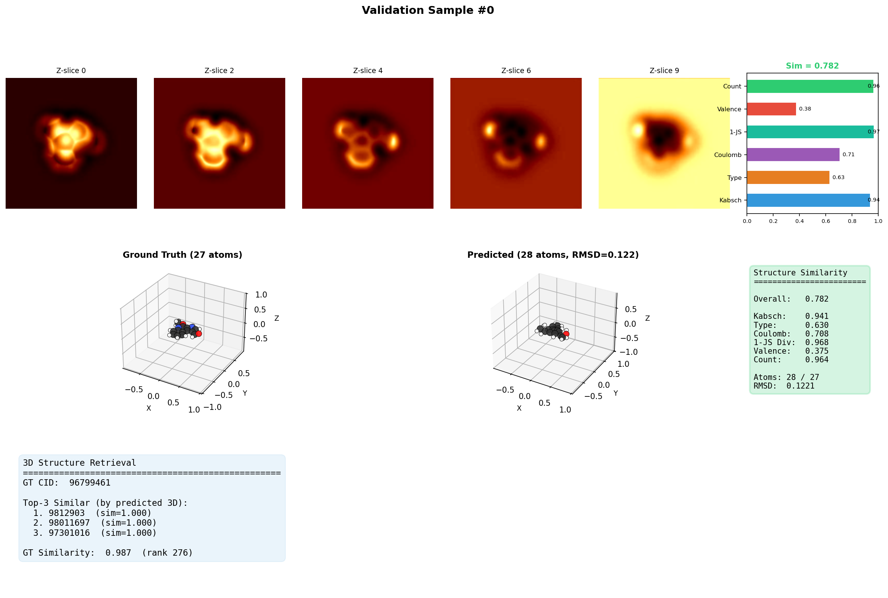 | 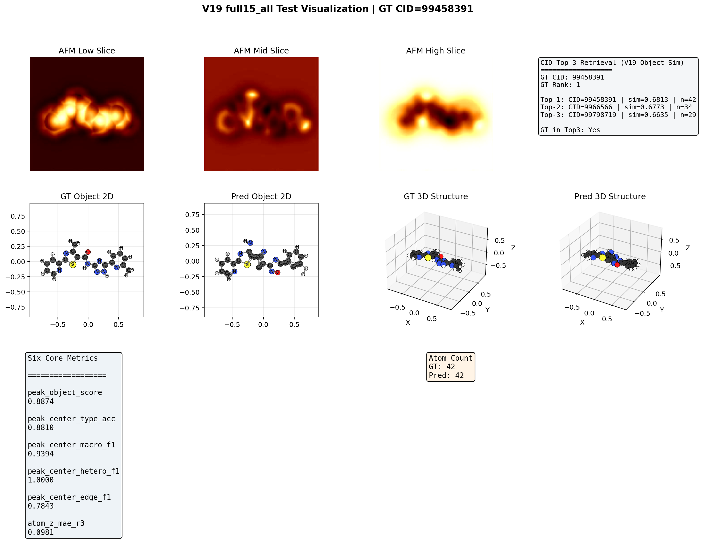 |  |
| 主链可见但 H 漂移、6 元环平面性破坏、底部坍塌 | 骨架完整、原子计数准确、底部在位 | 与 V19 接近,且为 pred-center 部署模式 |

### 11.3 V19/V20 同 ID 横向对比(三组样本)

| sample_id | V19 Full15 | V20 Medium10 |
|:---:|:---:|:---:|
| **00000** |  |  |
| **00255**(中位) | 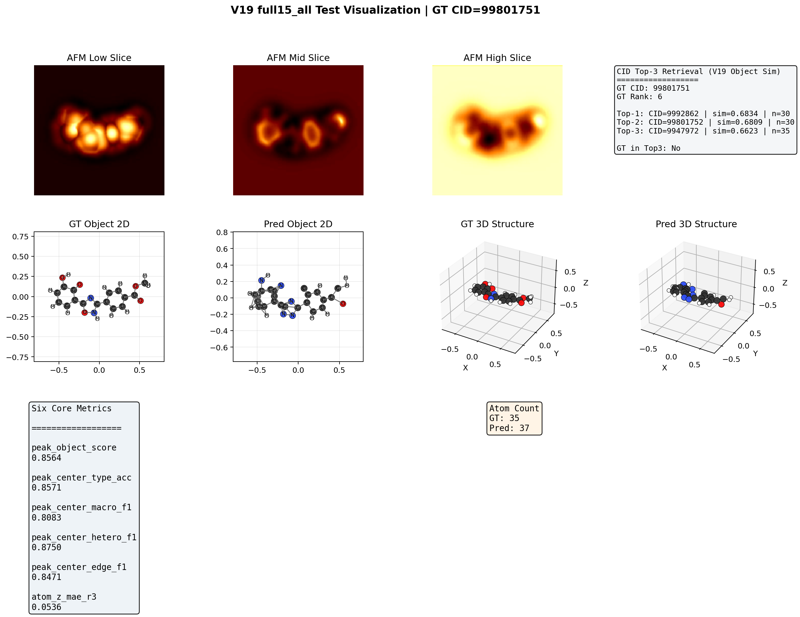 | 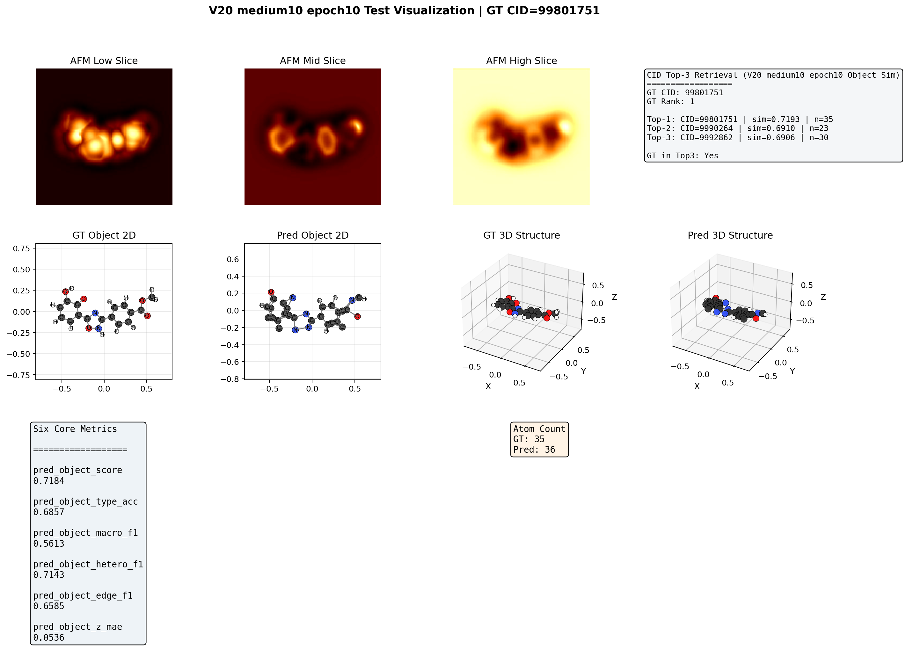 |
| **00511** | 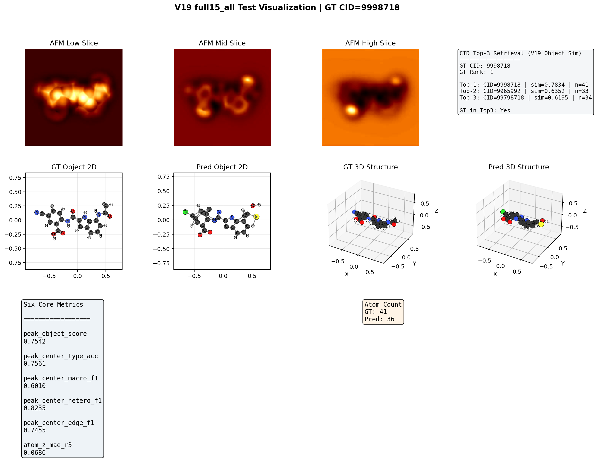 | 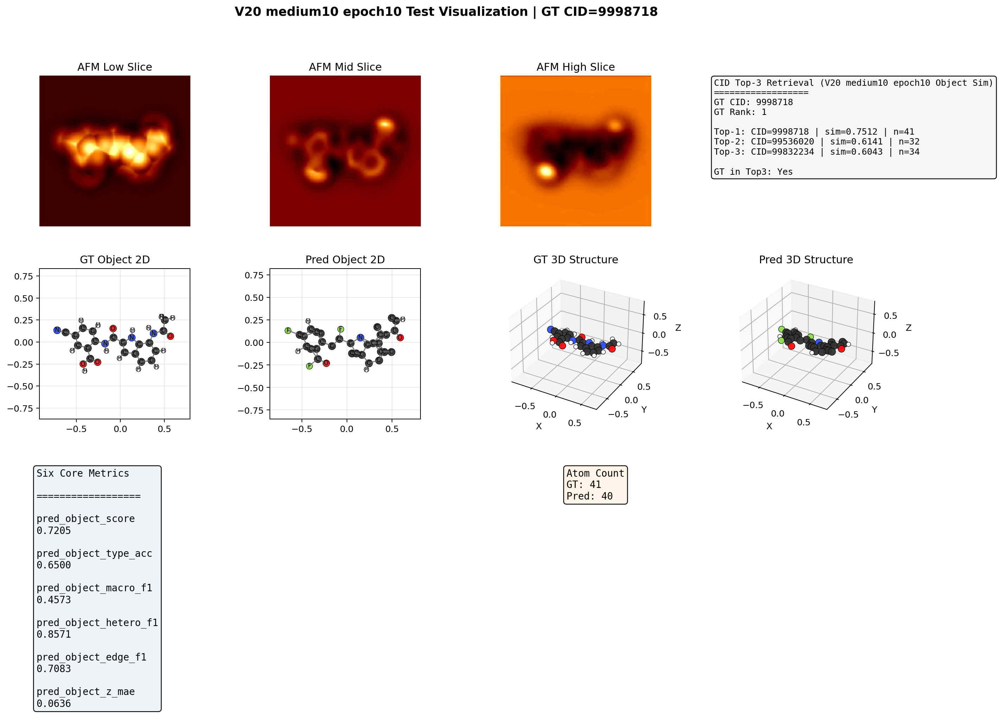 |

> V19 用 GT-center 评估更宽松;V20 用 pred-center 完成"封闭部署",指标体系不同但视觉质量已同档。

### 11.4 历史时代纵向追踪——同一分子(sample_00071)在 V8 → V20

下面这张表用**同一个 val 分子**(sample_00071,中等大小,含杂原子)看 8 代算法的重建轨迹。注意 V12-V16 的"骨架坍塌"、V14 的"几何精确但类型崩"、V19/V20 的"骨架 + 类型同时对":

| 版本 | 时代 | 重建结果 |
|:---:|:---:|:---:|
| V8 (60 ep) | Ⅱ. 编码器迭代 |  |
| V12 (60 ep) | Ⅲ. 检索头探索 |  |
| V14 (50 ep) | Ⅲ. EDM 等变 |  |
| V15 (50 ep) | Ⅳ. 去 SE(3) 转折 |  |
| V16 (50 ep) | Ⅳ. CID 检索(采样器 bug) |  |
| V16c (50 ep) | Ⅳ. 修 bug 反退化 |  |
| **V19 Full15** (15 ep) | **Ⅵ. 对象级监督** |  |
| **V20 Medium10** (10 ep) | **Ⅵ. 闭环部署** |  |

> V19/V20 的 sample_id 步长是 36(不是 71),所以这里用编号 00073 与 V8-V16c 的 00071 近似匹配同一分子。其余可视化文件可在 `experiments/v*/visualizations*/` 下查看,共 ~640 张历史样本。

### 11.5 关键指标历史曲线

| 版本 | epochs | 主指标 | 视觉通过率 |
|------|-------|-------|----------|
| V1 | 60 | RMSD 1.830 | ~0% |
| V2 | 60 | RMSD **0.255**, Type 43.6% | ~5% |
| V3 | 60 | RMSD 1.038(Focal Loss 灾难) | <1% |
| V5b | 50 | RMSD 0.269, Type **48.5%** | ~5% |
| V6 | 70 | RMSD 0.519(7 改动同时上崩) | <1% |
| V14 | 50 | RMSD **0.166** / N=3.6% / O=0.2% | ~5% |
| V15 | 50 | val_loss 5.49(首次"像分子") | ~5% |
| V16/V16b | 各 50 | val_loss 11.718(采样器 bug) | ~0% |
| V17 Bridge-A/B | 各 30 | val_loss 17.21 / 21.04 | <1% |
| V18(5 ckpt) | 各 30-50 | visual_pass_rate **0.0000** | 0% |
| **V19_full15** | **15** | **peak_object_score 0.802** | **~50%** |
| **V20 EXP-01** | **10** | **pred_object_score 0.714** | **~45%** |

### 11.6 V1-V18 失败的 5 条根因 → V19/V20 的对应解决方案

| 根因(V1-V18) | V19/V20 解决方案 | 代码位置 |
|---------------|-----------------|---------|
| **训练-部署 gap**:type head 训 GT、推理见 noisy | Curriculum: GT-center → peak-center → pred-center | [`docs/PRINCIPLES.md §三`](docs/PRINCIPLES.md) |
| **评估指标偏离用户需求** | object_score / peak_object_score / 视觉 review | [`docs/METRICS_GLOSSARY.md`](docs/METRICS_GLOSSARY.md) |
| **单监督单元(per-atom)** | 监督颗粒度上抬到 object 级 | `src/heads/object_heads.py` |
| **化学先验作 hard constraint** | 改为 logit bias 形式的 soft prior | `src/heads/type_head.py` |
| **缺"对象级"中间表示** | CenterConditionedTypeHead/EdgeHead | [`docs/TECHNICAL_DETAILS.md`](docs/TECHNICAL_DETAILS.md) |

### 11.7 给后续研究者的 5 条经验(从 V1-V18 失败中提炼)

1. **不要用"加损失"的方式注入化学约束** — V12/V16/V17 都因此失败,先验本身有误差时硬约束会被反向放大。
2. **训练 / 部署的输入分布必须一致** — V6 TypeNet/V12 GNN/V16 CID 检索头都死于此。
3. **可视化通过率比 RMSD/Type Match 更接近用户需求** — V14 RMSD 0.166 看似惊艳,但分子完全错。
4. **监督颗粒度决定结果颗粒度** — per-atom loss 永远做不出 per-molecule 正确的分子。
5. **每次只改一项** — V6 同时改 7 项性能崩塌,V19 是经历 5 个子版本逐步迭代才出 full15。

---

## 十二、数据集说明

| 数据集 | 来源 | 规模 | 用途 |
|---|---|---|---|
| **QUAM-AFM (K-1)** | Dataverse(ver. 10-2022) | 68,555 分子 × 10 层 AFM | 主训练 / 评估集 |

- **元素覆盖** — H, C, N, O, F, S, P, Cl, Br, I(10 种)
- **原子规模** — 1–85 原子/分子
- **AFM 参数** — K = 40 pN/nm,Amplitude = 40 pm
- **切片** — 128×128 × 10 深度
- **Split** — train/val/test ≈ 80/10/10(按 SMILES 哈希)

可视化资产位置一览(本仓库已包含 ~310 张图):

| 类别 | 位置 |
|---|---|
| V19 训练曲线 / 调度 | `experiments/v19_object_joint_full15_all/review/plots/` |
| V19 诊断样本(best/median/worst) | `experiments/v19_object_joint_full15_all/review/samples/` |
| V19 主样本 × 15 | `experiments/v19_object_joint_full15_all/visualizations_object15/` |
| V19 对比样本 × 15 | `experiments/v19_object_joint_full15_all/visual_compar_object15/` |
| V20 EXP-01 best/median/worst | `experiments/v20_object_joint_medium10_exp01_fulltest/samples/` |
| V20 EXP-02 检索分层图 | `experiments/v20_object_joint_medium10_exp02_retrieval_fulltest/plots/` |
| V20 EXP-03 缝隙直方图 | `experiments/v20_object_joint_medium10_exp03_gap_decompose/plots/` |
| V20 EXP-04 几何分布 | `experiments/v20_object_joint_medium10_exp04_geom_diagnostics/plots/` |
| V20 visual15 样本 | `experiments/v20_object_joint_medium10_epoch10_visual15/visualizations_object15/` |
| V2–V5b 历史样本 | `visualizations/v2_* ~ v5b_*` |
| 训练样例输出 | `outputs/curves/`、`demo/`、`molecules_*/`、`val_resnet/` |

总实验索引见:[`docs/V19_V20实验总索引与总结.md`](docs/V19_V20实验总索引与总结.md)。

---

## 十三、常见问题答疑(FAQ)

> 简版 FAQ。**专业技术 / 运行 / 解读**全部问题见 [`docs/FAQ_EXTENDED.md`](docs/FAQ_EXTENDED.md);安装与运行排错见 [`docs/RUNTIME_TROUBLESHOOTING.md`](docs/RUNTIME_TROUBLESHOOTING.md)。

### Q1. `run.sh` 跑完最后几步没产出 / 报错

`run.sh` 的 `[3/5]` 段 heredoc 传 `$SAVE_DIR` 时会变空(已知 bug),`[2/3] resnet3d` 段也被注释。建议直接:

```bash
python3 -m src.train --config configs/config.json
python3 -m src.visualize_val --checkpoint checkpoints/best_diffusion.pt --output_dir outputs/val_diffusion
```

详见 `docs/guides/COMMAND_COMPARISON.md`。

### Q2. 训练卡住 / 显存空转

仓库自带 `scripts/launchers/monitor_v20_object_joint_medium10.sh`,以 `STALL_SECONDS=1800` 判定 stall。报警后用配套 `supervise_*.sh` 自动 resume。

### Q3. 数据集找不到

`config` 里 `"data_root": "auto"` 会依次试 `/root/autodl-tmp/K-1/` 和 `/root/autodl-tmp/micro/dataverse_files/SUBMIT_QUAM-AFM/QUAM`。两路都不存在就失败。改为绝对路径或解压到其中之一。

### Q4. 首次训练加载数据很慢

首次扫描后生成 **pkl 缓存**,后续启动 <5 秒。改了 `min_corrugation` / `require_ring` / `max_samples` 等过滤项需手动删旧 pkl。

### Q5. RDKit 是必须的吗?

**不是**。无 RDKit 时自动跳过 MMFF94/UFF 弛豫,训练 / 推理流程不受影响。安装:`conda install -c conda-forge rdkit`(`docs/guides/RDKIT_INSTALLATION.md` 含完整验证清单)。

### Q6. 如何快速 smoke 验证?

按耗时由短到长:
1. `python3 -m src.quick_test` — 模块级,<1 分钟
2. `configs/config_v19_object_joint_full6h.json` — 中规模 ~6 小时

### Q7. 训练指标和 EXP-01 Full-test 数字对不上?

Full-test 用 `val_size=512` 在 **test split** 评估;训练日志的 `val` 在 **val split**。差 ~0.01 级别。

### Q8. 断点续训何时自动触发?

启动器检查 `latest_v19_object_joint.pt`,存在则 `--resume_checkpoint <它>`;否则 `warm_start_checkpoint` 或零开始。

### Q9. 想切到 3D-ResNet 基线?

老版 `src.train` 支持。把 `configs/config.json` 里 `"model_type"` 改成 `"resnet3d"` 再跑。V19/V20 主线**不**走这条。

### Q10. 训练脚本为什么只有 `--config` 和 `--resume_checkpoint`?

设计选择 — 所有超参放 JSON 便于实验对照和复现。CLI 定义在 [`src/train_v19_object_joint.py`](src/train_v19_object_joint.py)。

### Q11. 如何启动多卡 DDP?

**当前不支持**。所有训练以 `nohup python3 -u -m ...` 单进程启动。需手动包装 `DistributedDataParallel` + `DistributedSampler`(欢迎 PR,见 [`CONTRIBUTING.md`](CONTRIBUTING.md))。

### Q12. OOM 怎么调?

按影响从大到小:`batch_size 8→4` → `num_workers 8→4` → `max_samples` 限制 → 关 `augment_rotation`。**不要**改 `img_size=128`(下游硬编码)。

### Q13. 为什么没有 `requirements.txt` / `pyproject.toml`?

历史原因 — 项目从 Jupyter 实验逐步长成完整 pipeline。推荐依赖见 [§ 9.1](#91-环境安装)。欢迎贡献 PR。

---

## 十四、引用与致谢

### 数据集

- **QUAM-AFM** — Rubén Pérez et al., Universidad Autónoma de Madrid。完整引用见 `dataverse_files/readme.txt`。

### 主要参考文献

- **Video ViT** — Arnab et al., *ViViT: A Video Vision Transformer*, ICCV 2021
- **Knowledge Distillation** — Hinton et al., *Distilling the Knowledge in a Neural Network*, NeurIPS Workshop 2014
- **Focal Loss** — Lin et al., *Focal Loss for Dense Object Detection*, ICCV 2017

### License

MIT License — 详见 [LICENSE](LICENSE)。

### 贡献

欢迎 PR / Issues 详见 [`CONTRIBUTING.md`](CONTRIBUTING.md)。优先方向:`pyproject.toml`、多卡 DDP、smoke 配置、可视化增强。

---

<div align="center">

> 仓库不含训练好的模型权重 / 数据集本体 / 训练 checkpoint(见 `.gitignore`)。
> 需在自己的机器上从 QUAM-AFM 重新训练:
> V19 Full15 ≈ 36h(单 A100),V20 Medium10 ≈ 10h(单 A100)。

</div>
