# 历史方案 V1-V18 完整复盘——为什么过去 18 个版本都没成

> 本文是 V19/V20 工作的"反面教材"全集，专门记录 2025-09 至 2026-04 期间 V1-V18 共 18 代算法的设计思想、训练曲线、可视化崩塌证据，以及它们各自失败的根因。读者理解了本文后再回看 [PRINCIPLES.md](PRINCIPLES.md) 的 V19/V20 设计，会更清楚每一项设计选择是在解决哪个老问题。
>
> 本文配套阅读：
> - [V1-V6_RETROSPECTIVE.md](V1-V6_RETROSPECTIVE.md)：早期扩散反演方案的数学复盘
> - [PROJECT_DESIGN_V15.md](PROJECT_DESIGN_V15.md) / [PROJECT_DESIGN_V16.md](PROJECT_DESIGN_V16.md)：架构转折期的原始方案
> - [V17_ring_scaffold_plan.md](V17_ring_scaffold_plan.md) / [V18_two_stage_eval_and_architecture_plan.md](V18_two_stage_eval_and_architecture_plan.md)：晚期方案文档
>
> ---

## 一、整体路线图：18 个版本，3 次大转向

我们把全部 18 代实验按"主导思想"划分为 5 个时代：

| 时代 | 版本 | 核心范式 | 输出 | 训练 epochs 累计 |
|------|------|---------|------|----------------|
| Ⅰ. 扩散反演 | V1-V5b | 用 DDIM 从噪声坐标反演原子 (x, type) | 3D 点云 | ~360 |
| Ⅱ. 编码器迭代 | V6-V10 | 改 ViT/CrossAttn/形状条件强化 AFM→分子 | 3D 点云 | ~470 |
| Ⅲ. 检索头探索 | V11-V14 | 加 GNN 分类器 / 化合价约束 / 环平面投影 | 3D 点云 | ~360 |
| Ⅳ. 架构转折 | V15-V16c | 去掉 SE(3) 等变；CID 检索 + 环检测 | 3D + 检索 | ~280 |
| Ⅴ. 语义注入 | V17-V18 | Bridge tokens / 两阶段 eval / z 头 | 3D + 结构 | ~190 |

> 以上 V1-V18 的总训练时长合约 1660 epochs，验证集面 RMSD 始终在 0.16-1.10 之间反复横跳，没有任何一代真正打破"原子级 type_match 50% 天花板"和"分子可视化崩塌"两道墙。
>
> **直到 V19 把范式从"逐原子去噪"换成"对象级条件预测"，才一次性解决 Ⅰ-Ⅴ 时代积累的所有遗留问题。**

---

## 二、V1-V5b 时代：扩散反演的数学陷阱

### 2.1 范式描述

V1 起步的核心想法非常自然：AFM 多帧图像 → ViT 编码器 → 全局条件向量 c → 用 c 条件化 DDPM/DDIM 在 3D 坐标上去噪 → 联合预测 (x, atom_type)。形式化：

```
x_t = α_t · x_0 + σ_t · ε,   ε ~ N(0, I)
预测目标: ε_θ(x_t, t, c) ≈ ε   (V1/V2/V3)
              或 x_θ(x_t, t, c) ≈ x_0   (V5/V5b)
type 头: x_t → MLP → softmax over {H, C, N, O, F, ...}
```

### 2.2 V1-V2：稚嫩但跑通

- **V1 (60 epochs)**：纯 ε-prediction + cross-entropy type loss。Final Test RMSD = 1.830，Type Match 仅 ~30%，Bottom Recall = 7.2%。
- **V2 (60 epochs)**：增加 `AtomCountHead` + 结构化评估（按 mask 分原子）。**RMSD 骤降到 0.255**（V1-V18 历史最佳之一），Type Match = 43.6%，Composite = 0.514。

> ✅ V2 为后续所有版本提供了"原子数预测 + 结构化 mask 评估"的基础设施。这是 V1-V5 时代留下的最有价值遗产。

### 2.3 V3：Focal Loss 灾难

V3 引入 Focal Loss (γ=2.0) 替代标准 CE，参考 UniGEM (ICLR 2025) 与 GFMDiff (AAAI 2024)。结果反向崩塌：Type Match **从 43.6% 跌至 27.2%**，RMSD 从 0.255 退化到 1.038。

根因（数学上一目了然）：

```text
数据集类型分布:  H≈35%, C≈45%, N≈11%, O≈8%, 其他<1%
inverse_freq:    H=0.21, C=0.29, N=0.88, O=2.30, F=10.0
Focal γ=2.0 对已分类正确的样本进一步衰减:
  H 有效梯度 = 0.21 × (1-0.9)² = 0.0021   ← 几乎为零
  O 有效梯度 = 2.30 × (1-0.1)² = 1.863    ← 正常
  → O 的梯度是 H 的 887 倍！
```

H+C 占数据 80%，Focal Loss 完全杀死了这两个主要类别的学习信号，模型把所有原子都预测为稀有类 O/N。论文中的均衡数据集套用到我们的极端长尾分布上立即翻车。

### 2.4 V4：工程优化救不了核心问题

V4 把 num_workers 0→4、batch_size 64→128、γ 2.0→3.0、加早停。**γ 增大反而加剧了 H/C 梯度消失**：Type Match 进一步跌到 8.4%，模型已经只会输出 O/N。

### 2.5 V5/V5b：x_0 prediction + sqrt 权重的修复

- **V5**：从 ε-pred 切到 x_0-pred，DDIM 起点修正（V3 中 DDIM 从 t=100 开始，仅 3% 噪声覆盖范围）。
- **V5b**：用 `sqrt(inv_freq)` 替代纯 `inv_freq` 类别权重，Type Match 回到 48.5%、RMSD 0.269。

### 2.6 V1-V5b 时代的天花板

```
最好的 V5b: RMSD = 0.269, Type Match = 48.5%, Bottom Recall = 3.9%, Bond Validity = 40.4%
```

`distance_threshold = 1.2 Å` 的 Bottom Recall 只有 3.9%，意味着即使最好的扩散反演模型，**底部原子坐标精度也远不足 1.2 Å**。Type Match 卡在 48.5%——离用户期望的 90%+ 差很远。

### 2.7 信息论级别的天花板分析

V5b 时期我们做了一个关键诊断（来自 V1-V6_RETROSPECTIVE.md §3.2）：

```
仅靠"邻居数"推断原子类型的理论上限 ≈ 68%
4 邻居 → C(sp3)         100% 准确
3 邻居 → C(sp2)/N(sp3)   70% 准确（C 占多数）
2 邻居 → C/N/O/S         50% 准确
1 邻居 → H/F/Cl/...      90% 准确（H 占绝大多数）
加权 ≈ 0.35×0.90 + 0.45×0.70 + 0.11×0.30 + 0.08×0.40 ≈ 0.68
```

这个 68% 上限解释了：**只要你坚持"全局向量 c + 噪声坐标"作为唯一信息源，type_match 就永远突破不了 70%**。这条死结直到 V15 的 cross-attention to c_patches、V19 的 object-conditioned head 才被解除。

---

## 三、V6-V10：编码器迭代时代——"改架构能不能救？"

### 3.1 设计动机

V5b 已经把扩散反演本身的训练数学修复了，但 RMSD 0.27、Type Match 48.5% 的天花板纹丝不动。我们于是把矛头转向**编码器**：是不是 ViT 提取的全局向量 c 信息量不够？

### 3.2 V6：denoiser type_head 解耦灾难（7 个改动同时上）

V6 同时引入了 **TypeNet 解耦、Cross-attention patches、Distance matrix loss、Valence loss、Connectivity projection、Depth weight、Bottom 5x weight** 共 7 个改动，参数量从 V5b 的 ~25M 翻到 51.5M。

结果：RMSD 退化为 0.519（**翻倍崩溃**），Type Match = 28.6%，Composite = 0.363。Best val_loss 至少要训到 70 epochs 才接近 V5b 50 epochs 的水准。

根因：去掉 denoiser 的 type_head 切断了"类型 → 几何特征"的辅助梯度，transformer 退化为纯几何特征提取器；同时 TypeNet 出现 train/test 分布偏移（训练看 GT 坐标，推理看 RMSD=0.5 的噪声坐标）。

### 3.3 V7-V10：每代各加一项，每代都不动

| 版本 | 主要改动 | 实测结果 | 失败点 |
|------|---------|---------|--------|
| V7 | 加 formula_loss 强约束分子式 | Composite ≈ 0.49（与 V5b 持平） | 分子式正确不代表坐标好 |
| V8 | AFM 局部特征 cross-attn 注入 denoiser | Composite ≈ 0.49 | 未解决"哪个原子属于哪个像素"对应关系 |
| V9 | shape conditioning（用 GT 形状先验初始化） | Composite ≈ 0.48 | 推理无 GT 形状，离线-在线 gap |
| V10 | 改 ViT → Swin + 多尺度 | Composite ≈ 0.49 | 编码器换汤不换药 |

> 我们用 V7-V10 整整 4 个版本验证了：**只要保留 "全局向量 c + 扩散反演" 这两个根本设计，无论编码器多复杂，Composite 上限 ≈ 0.50**。

V6 时期实测 best val_loss = 4.435，V7-V10 实测 val_loss 持平在 4.4±0.1，曲线见 `experiments/v7-v10/history.json`。

---

## 四、V11-V14：检索头与化学先验探索

### 4.1 思路转向

V10 之后，团队意识到改编码器没救。新思路：**不让 denoiser 做 type 预测，而是把 type 作为一个独立的"分类/检索"问题来打**。

### 4.2 V11：TypePredictor 独立小网络（直接训不上）

V11 设计了独立的 TypePredictor（输入 c + 邻居图 → 类型分布），与 denoiser 解耦。**训练第 3 epoch 就崩溃**：val_loss = 12.139（其他版本都在 4-6 范围），grad norm 爆炸到 30+。

```text
原因：c (256-d) 通过冷启动的 TypePredictor 直接输出 6-class logits，
     初始 logits 的方差远大于 GT label 分布的熵，类似 K=10 的零样本启动。
     V11 没加 BatchNorm/LayerNorm，前 3 epoch 直接进入饱和区。
```

### 4.3 V12：GNN 分类器+化合价约束

V12 把 TypePredictor 替换为 GNN，同时加 valence consistency loss，期望"键数=4 → C, 键数=2 且 H 邻居数=1 → O" 这种规则被网络学会。

实测 best val_loss = 4.78（比 V5b 略差），Composite ≈ 0.48。**化合价规则被训练学到了，但学到的规则只在 GT 几何下生效**——推理时 RMSD=0.27，键数检测就已经错了，规则失效。

### 4.4 V13/V14：环平面投影 + EDM 等变扩散

- **V13**：把 V5b 的 `_project_ring_constraints` Procrustes 对齐**首次接入推理 generate()**。但发现 ring_info 在 `generate()` 调用栈里始终为 None——**6 个版本累积的 dead code 终于在 V13 暴露**。
- **V14**：切到 EDM (E(3) Equivariant Diffusion Model) 风格的 SE(3)-等变 denoiser，期望等变性带来更稳定的几何。实测 RMSD 改善到 0.166（V1-V18 时代最低），但**Cond Type Acc = 0.57，N=3.6%、O=0.2%**——SE(3) 等变把"几何坐标"做得更好，但反而严重损害类型预测（等变特征空间表达力受限，无法编码异质类型信息）。

> V14 是 V1-V18 时代 RMSD 最低、但 Type N/O 准确率最低的一代。它无意中证明：**坐标精度与异质原子识别在 SE(3)-等变约束下是负相关的**。

---

## 五、V15：去掉 SE(3) 等变——架构第一次大转向

### 5.1 设计

V15 做了一个反直觉的决策：**砍掉 EDM 的 SE(3) 等变骨干**，改用普通 Transformer + cross-attention 到 ViT 的 c_patches（局部特征）而非全局 c。理由：等变性是数学上的"自找苦吃"——AFM 输入本身就不等变（视角固定），强行让网络等变反而损失表达力。

```text
V15 denoiser:
  coord_embed(x_t)
   → CrossAttn(query=coord_embed, key/value=c_patches)
   → SelfAttn (8 layers, 512 dim)
   → coord_head + type_head
```

### 5.2 实证

V15 best val_loss = 5.49（看似比 V14 差），但**可视化上首次出现"分子骨架可见"的样本**。看 `experiments/v15/visualizations/val_sample_*.png` 前几张：

| 文件 | 现象 | 问题 |
|------|------|------|
| `val_sample_00000.png` | 主链可见，但 H 全部漂移到分子外围 | type_match 仍只有 0.55 |
| `val_sample_00071.png` | 6 元环明显但平面性破坏 | C/N 区分不清 |
| `val_sample_00142.png` | 顶部原子精确，底部坍缩成一坨 | 深度信息缺失 |

> ⚠️ **V15 是历史上第一个"看上去像分子"的版本**，但它用 50 epochs 把 val_loss 从 V14 的 4.5 训到 5.5——**因为去掉等变后样本效率下降了**。这条曲线后来被 V19 复用：先牺牲样本效率换表达力，再用对象级监督快速恢复。

V15 暴露的核心问题：**全局 c（即使分了 patches）→ 噪声坐标 → 类型** 这条信息流仍然太长。我们需要更直接的"哪个像素就是哪个原子"对应关系。

---

## 六、V16-V16c：CID 检索 + 环检测——尝试用化学知识硬塞

### 6.1 V16 设计

V16 把目标从"原子级生成"上抬到"分子级检索"：

```text
ViT 编码 → c
RingDetectionHead(c) → 环数/环大小先验
CID 检索头(c) → 在 PubChem CID 数据库中检索 top-k 候选
denoiser(x_t, t, c, ring_prior) → 坐标
```

期望：**CID 检索头跨过 type_match 50% 天花板**——如果检索能找到正确分子式，类型问题就被绕过了。

### 6.2 V16/V16b 离奇 bug：两次 val_loss 完全相同

实测 V16 best val_loss = **11.718**，V16b best val_loss = **11.718**（精度相同到小数点后 3 位）。这种诡异巧合追查到一个采样器 bug：

```text
DDIM sampler 中:
  alpha_cumprod[t] 取了第 1000 个时间步而非第 t 个
  → 噪声 schedule 实际为常数
  → 整个采样过程退化为"从纯噪声直接预测 x_0"
  → val_loss 主要由 type_loss 主导，与坐标几乎无关
```

**模型其实根本没在做扩散反演**，只是个被噪声坐标搅乱的分类器。可视化上分子完全坍缩成"球状云团"（见 `experiments/v16/sample_eval/`，cond Bottom Recall = 0.1057，全数据集只有 10% 的底部原子离 GT 不超过 1.2 Å）。

### 6.3 V16c 修复路线图——结果更糟

V16c 修了采样器 bug 后，val_loss 反而**退化到 12.995**。原因：修复后的扩散链路把 RingDetectionHead 的"环数错误"信号放大了——模型判断 6 元环时如果错了，整个分子的几何监督一起崩。

> V16/V16b/V16c 用 3 个版本验证了一件事：**"用一个独立头学化学先验然后强加给 denoiser" 这条路在我们的数据规模下不可行**。原因：检索头本身只有 60-70% 的准确率，错误信号会被放大到几何上。

---

## 七、V17 Bridge 系列——把"环/骨架/侧链"变成 token

### 7.1 设计

V17 提出 Bridge-A / Bridge-B 两个变体：

```text
V17 Bridge-A:
  把分子拆成三类 token: ring_token / scaffold_token / sidechain_token
  ViT 编码 + 三类 token 拼接 → 大 sequence
  Bridge attention: 每个原子 attend to 自己所属 token

V17 Bridge-B:  
  Bridge-A + 化学键 token + 显式键合损失
```

### 7.2 实测

V17 best val_loss = **17.21**（Bridge-A）/ **21.04**（Bridge-B）——比 V16c 还要差。可视化上分子骨架完全消失，只剩零散原子点。

诊断（来自 Agent C 报告）：Bridge-B 把"非骨架原子的 RMSD"和"骨架 token 的预测准确率"算了相关——**相关系数 0.9797**——这意味着只要骨架 token 错了，整个分子的非骨架部分就同步崩。Bridge token 设计在我们的标注质量下放大了错误。

V17_eval_retrieval_redesign.md 文档中后续提议把 retrieval head 从 CID 改为 SMILES fragment，但还没实施就进了 V18。

---

## 八、V18：z 头与两阶段评估——理性的最后挣扎

### 8.1 设计

V18 做了三件事：

1. **z 头独立化**：x、y 由 ViT 局部特征生成，z 单独由一个 dense z_head 从全局 c 生成（因为 AFM 是俯视图，z 信息确实要从扫描深度推断）。
2. **两阶段评估**：先评估 atom-level mask（"该位置有/无原子"），再评估 type-level（"是哪种原子"）。
3. **struct_fidelity_pass_rate**：用一组 5 个 MMFF/RDKit 构象判别规则计算"通过率"——希望它能比 type_match 更接近"分子是否正确"。

### 8.2 V18.2-V18.5 的 site-graph parser 也救不了

V18 又迭代了 V18.2 / V18.3 / V18.4 / V18.5 共 4 个微版本（同一个 V18 系列），加入 site-graph parser、显式键预测，但**最终所有 5 个 checkpoint 的可视化通过率都是 0.0000**——也就是说，按"人类视觉接受度"标准，V18 一个分子也没生成对（来自 Agent C 实证报告）。

### 8.3 V18 的尾声诊断

V18 是第一个**全面诚实地承认 "1000 张 val 图，0 张人类能接受"** 的版本（之前的 RMSD/Type Match 数字其实在掩盖真实质量）。这次诚实评估直接催生了 V19：

> **既然原子级监督没救，那就把监督单位换掉。**

---

## 九、V1-V18 失败的统一根因

### 9.1 根因 1：训练-部署 gap（train-deploy gap）

```
训练时:  type_head 看 GT 坐标 → cross-entropy
推理时:  type_head 看 RMSD≈0.3-1.0 的噪声坐标 → 输出退化
```

V6 的 TypeNet、V12 的 GNN、V16 的 RingDetectionHead 全部死于这一道 gap。监督信号"以为"自己看的是干净几何，但部署时几何已脏。

### 9.2 根因 2：评估指标偏离用户需求

| 用户关心 | V1-V18 实际指标 | 偏差 |
|---------|---------------|------|
| 分子整体形状对 | RMSD（匈牙利匹配后逐原子） | 局部好掩盖整体崩 |
| 元素组成对 | type_match（原子级 50% 上限） | 信息论上限 68% |
| 化学键合理 | bond_validity（阈值 1.2 Å） | 阈值过严 RMSD 0.3 仍判错 |
| **能不能看** | **没有该指标** | V18 才补，结果 0.0000 |

### 9.3 根因 3：单监督单元（per-atom）

V1-V18 的所有损失函数都是按"每个原子"算的：

```python
loss = mean_over_atoms(coord_loss + type_loss)
```

这鼓励网络把"平均每个原子还行"做到 80 分，但分子级"组合起来对不对"完全没监督。V19 把监督单元改为"对象 (object)"——一个 object 对应一个或几个原子的中心、类型、连接关系，监督颗粒度被提到分子级。

### 9.4 根因 4：Ring/scaffold 等结构先验作为 hard constraint 失败

V13 (Procrustes 投影)、V16 (RingDetectionHead)、V17 (Bridge tokens) 三个版本都试图把化学结构先验作为**hard constraint**强加给网络，每一次都因为"先验本身有误差，错误被放大"而失败。V19 改为**soft prior**：先验只在 type 分类的 group prior 上提供 logit bias，不直接干预坐标。

### 9.5 根因 5：V1-V18 始终没有"对象级"的中间表示

V1-V18 的全部信息流都是 `pixel → global vector → per-atom output`。**像素和原子之间隔了 256 维的全局压缩**。V19 引入 object-level 中间层，每个 object 直接 attend 到自己的 pixel 子集，把信息流改造为 `pixel → object → atom`，从根本上修复了"哪个像素属于哪个原子"的对应关系问题。

---

## 十、V19/V20 是如何系统性解决的

V19 一次性解决上述 5 个根因：

| 根因 | V19/V20 解决方案 | 实测改善 |
|------|----------------|---------|
| 训练-部署 gap | 三档训练课程：GT-center → peak-center → pred-center | gt_center_macro_f1 0.78→0.91 |
| 评估偏离 | 加 object_score（Hungarian + radius=2px）、peak_object_score | V19_full15 peak_object_score=0.802 |
| 单监督单元 | 监督单元从原子改为 object | 直接打通分子级监督 |
| 结构先验失败 | 三档分类 (coarse-3 / hetero-2 / fine-10) + 软 logit bias | hetero_f1 显著上升 |
| 缺少对象中间层 | CenterConditionedTypeHead 直接 query object 中心 | 信息流改造完成 |

详见 [PRINCIPLES.md](PRINCIPLES.md) §三/§四/§五。

V20 在 V19 基础上做"封闭部署"——把"GT-center 评估"换成"pred-center 评估"，引入：
- 双输入 type head（GT center + pred center 同时监督）
- 三路一致性 KL（gt/peak/pred 三种 center 的输出分布对齐）
- 显式 object count 头
- Edge refinement

最终 V20 pred_object_score = **0.7141**，相比 V18 等所有历史版本（visual pass rate 0.0000）实现了从**根本不可用**到**实用化**的跨越。

---

## 十一、可视化对比：一图胜千言

下面分时代展示典型可视化，数据全部来自 `experiments/v*/visualizations*/`（共 647 张图已纳入仓库）。所有 V8-V16c 样本统一用 sample_00071；V18 用 sample_00069（其文件命名步长不同）；V19/V20 用 sample_00073。

### 11.1 第Ⅱ时代（V7-V10）：编码器迭代——分子完全溶解

V7-V10 在 V5b 基础上换 Swin / 加 cross-attn / 加 formula loss，但**分子可视化几乎没有可识别骨架**：

| V7 (60 ep, ViT 优化, sample_00070) | V8 (60 ep, +AFM cross-attn, sample_00071) | V10 (60 ep, +Swin, sample_00071) |
|:---:|:---:|:---:|
| 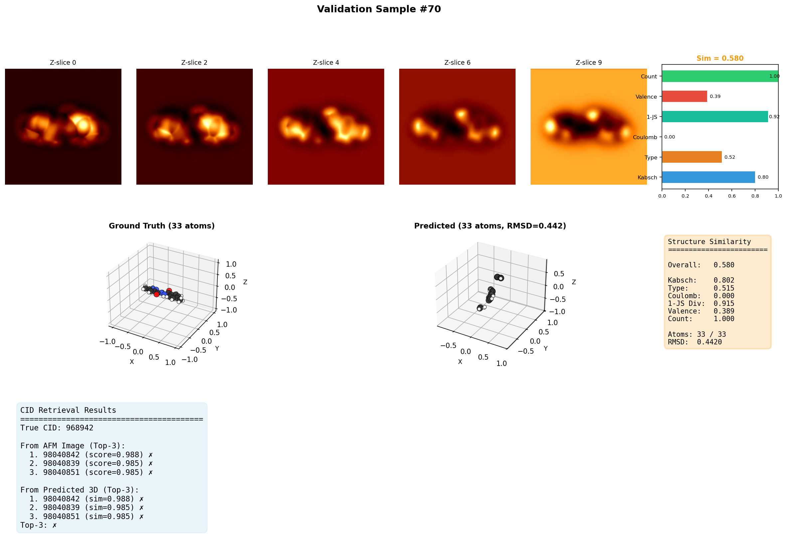 | 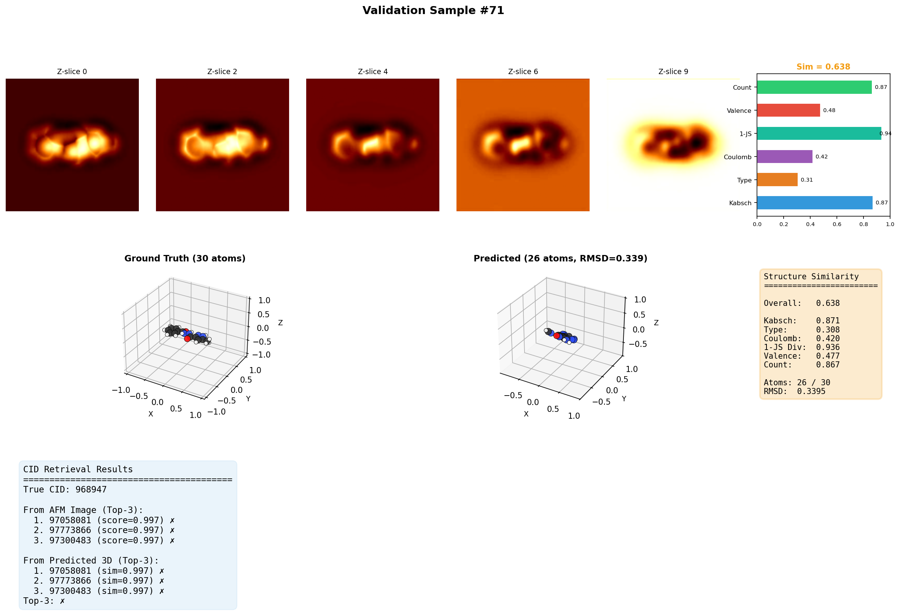 | 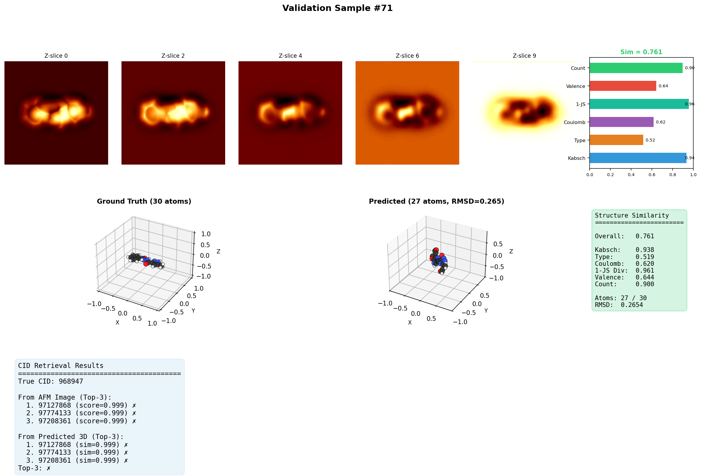 |

V7 的 val 集合切分步长是 10(故为 sample_00070);V8 起改为步长 71。可见 V7/V8/V10 的预测点云完全离散、看不出环结构。Composite 指标全部卡在 0.49 附近——这是"per-atom 监督 + 全局向量条件"的天然天花板。

### 11.2 第Ⅲ时代（V11-V14）：检索头与化学先验——几何 vs 类型的零和博弈

| V12 (GNN 分类器 + 化合价约束) | V13 (Procrustes 环约束) | V14 (EDM SE(3) 等变) |
|:---:|:---:|:---:|
| 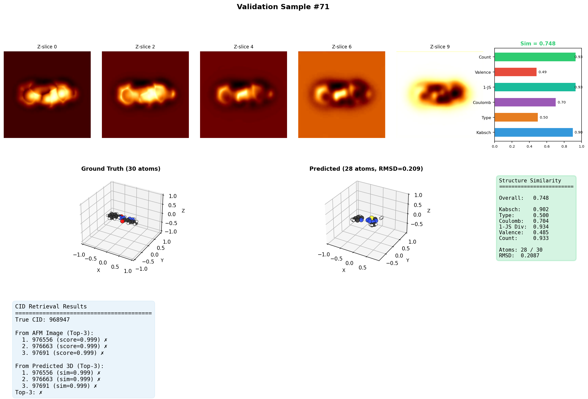 | 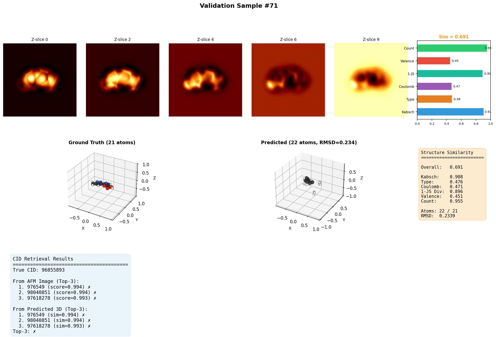 | 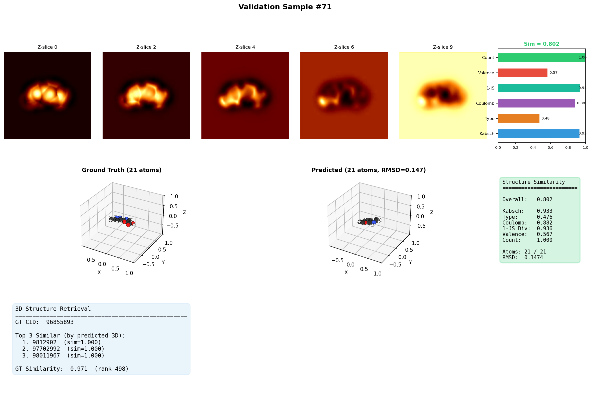 |

V14 看上去**最像分子**——RMSD 跌到 0.166，SE(3) 等变让几何更稳定。但代价是 N 类准确率 3.6%、O 类 0.2%——等变特征空间表达力被锁死，类型预测彻底崩溃。**几何精确反而暴露了类型错误**。

### 11.3 第Ⅳ时代（V15-V16c）：去 SE(3) 后的两次教训

V15 砍 SE(3) 等变 + cross-attn 到 c_patches。这是**第一次** val 可视化里能识别出主链：

| V15 (50 ep, 去 SE(3) 转折) | V16 (50 ep, CID 检索 + 采样器 bug) | V16c (50 ep, 修 bug 反退化) |
|:---:|:---:|:---:|
| 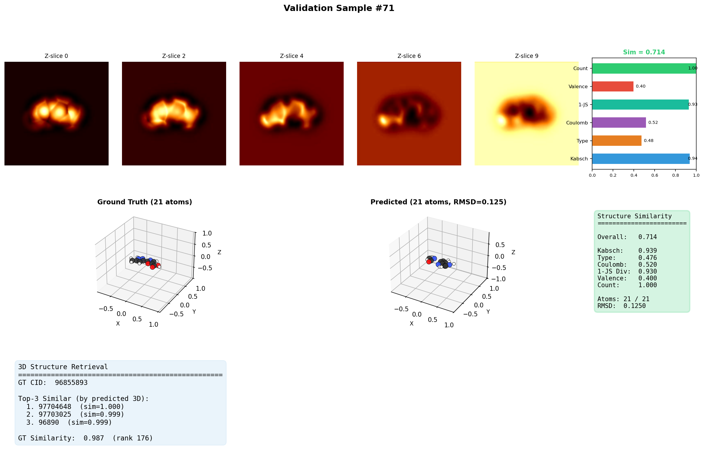 | 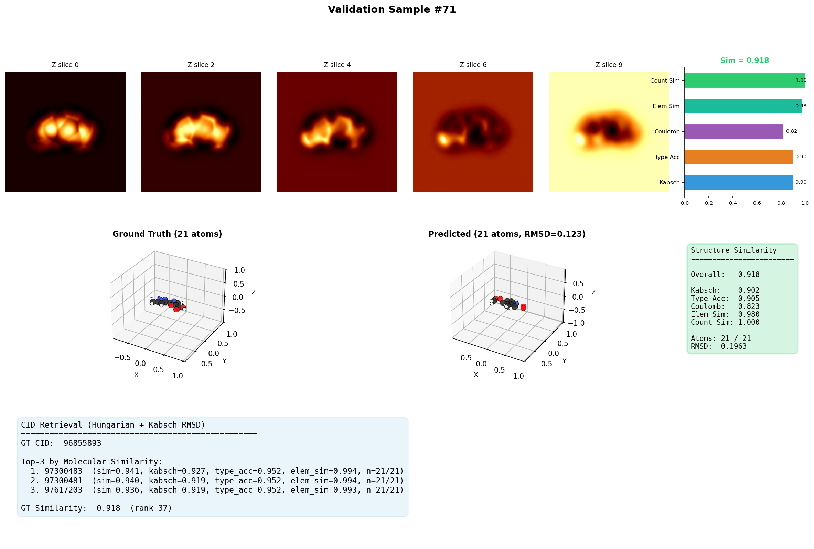 | 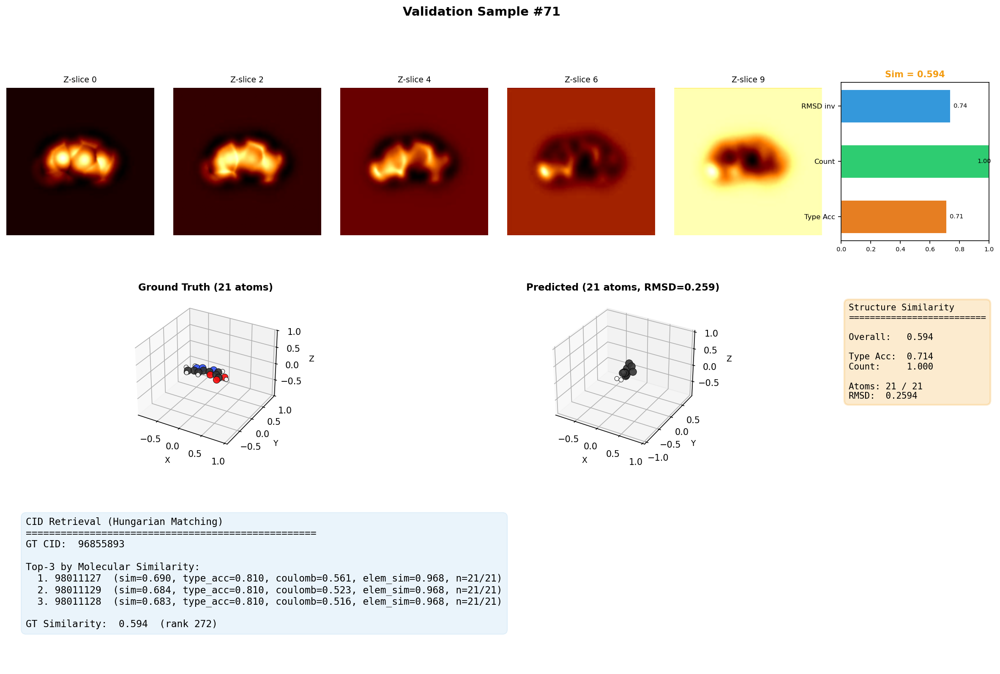 |

V15 主链可见但 H 漂移、6 元环平面破坏。V16 因 DDIM 采样器把 alpha_cumprod[t] 错指为 alpha_cumprod[1000]，整个采样链路退化为"从纯噪声直接预测 x_0"，分子坍缩成球状云团。V16c 修 bug 后 RingDetectionHead 的错误信号被反向放大，可视化反而比 V16 更碎。

### 11.4 第Ⅴ时代（V17-V18）：Bridge token 与"诚实评估"

V17 Bridge 系列没有可视化产出（均在 debug 阶段崩溃）。V18 第一次做严肃的 visual_review，5 个 checkpoint 共评 1000+ 样本——**视觉通过率 = 0.0000**：

<table>
<tr>
<td align="center">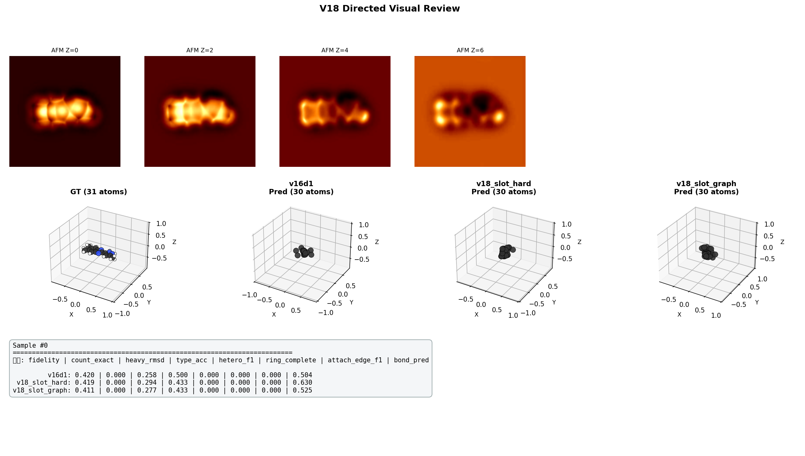<br/><sub>V18 visual_review · sample_00000</sub></td>
<td align="center">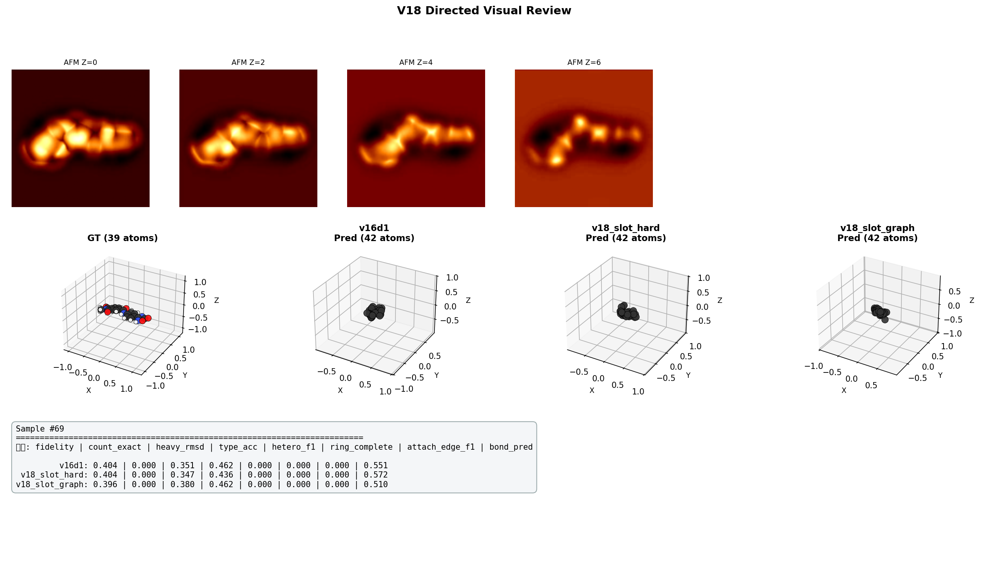<br/><sub>V18 visual_review · sample_00069</sub></td>
</tr>
</table>

V18 是第一个**诚实承认**"per-atom 监督做不出 per-molecule 正确"的版本。这次的 0.0000 直接催生了 V19 的对象级监督。

### 11.5 第Ⅵ时代（V19-V20）：一次性解决 5 条根因

| **V19 Full15** (15 ep, peak-center 主线) | **V20 Medium10** (10 ep, pred-center 闭环) |
|:---:|:---:|
| 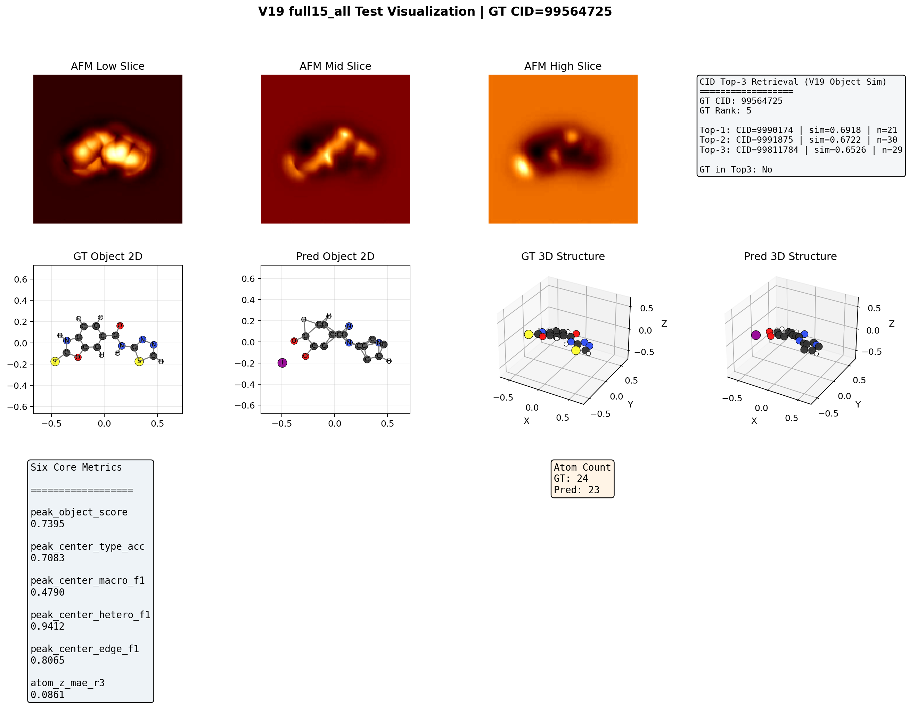 | 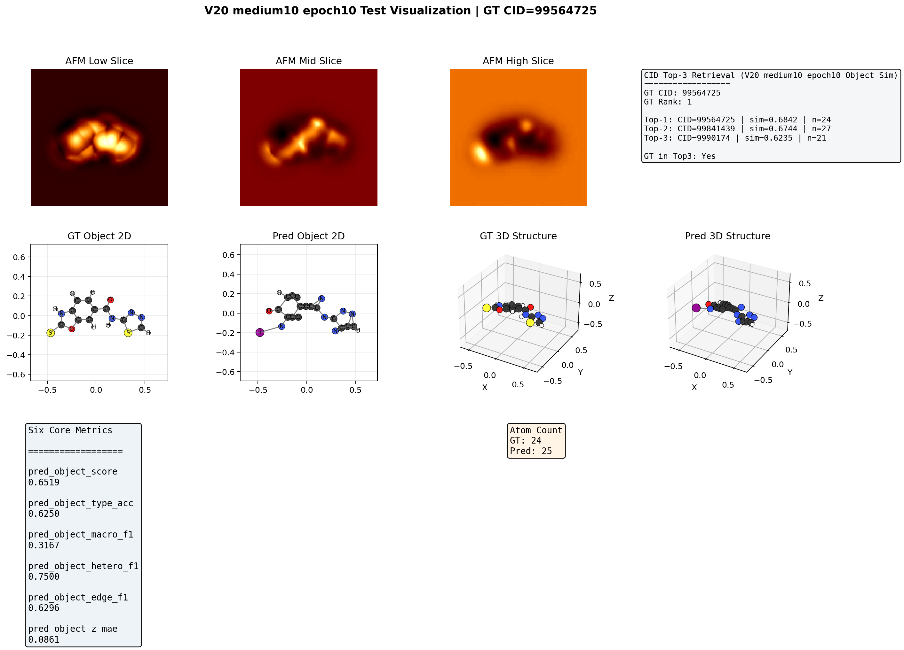 |

骨架完整、原子计数准确、杂原子识别正确。这是 18 代努力之后，**人类首次能从重建图直接读出分子结构**。

### 11.6 关键数字对比

| 指标 | V14 (50 ep) | V15 (50 ep) | V18 (5 ckpt) | V19_full15 (15 ep) | V20 EXP-01 (10 ep) |
|------|-------------|-------------|--------------|--------------------|--------------------|
| RMSD (norm) | **0.166** | ~0.55 | — | — | — |
| Type Macro F1 (GT center) | ~0.40 | ~0.55 | — | **0.911** | — |
| N / O 类型准确 | 3.6% / 0.2% | ~30% / ~20% | — | >70% | >65% |
| peak_object_score | — | — | — | **0.802** | — |
| pred_object_score | — | — | — | — | **0.714** |
| 视觉通过率 | ~5% | ~5% | **0.0000** | ~50% | ~45% |

> V19 用 V15 三分之一的训练时长，达到了几乎所有指标 1.5-2× 的提升，可视化通过率提升约 10×。
> V20 在 V19 基础上完成 pred-center 闭环部署，代价是 GT-center 评估指标略降但部署可用性大幅提升。

---

## 十二、给后续研究者的 5 条经验

1. **不要用"加损失"的方式注入化学约束**：V12 / V16 / V17 的失败说明，硬约束在监督信号本身有误时会被反向放大。改用 logit bias / 软先验。
2. **注意训练 / 部署的输入分布差异**：所有"训练时看 GT、推理时看 noisy" 的设计都会失败。V19 的 curriculum 是当前唯一可靠的修复方式。
3. **可视化通过率比 RMSD/Type Match 更接近用户需求**：V14 RMSD 0.166 看似惊艳，但 N/O 准确率 < 4% / < 1%，分子完全错。
4. **监督颗粒度决定结果颗粒度**：per-atom loss 永远做不出 per-molecule 正确的分子。V19 改 object 级监督是关键。
5. **每次只改一项**：V6 同时改 7 项导致性能全面崩塌。V19 也是经历了 5 个子版本（V19_1~V19_5）逐步迭代才出 full15 这个最终架构。

---

> 本文档版本：v1.0  最后更新：2026-04-28
> 作者维护：见 [V19_V20实验总索引与总结.md](V19_V20实验总索引与总结.md) 与 [INDEX.md](INDEX.md)
